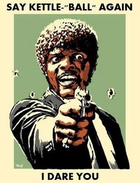

YHC rolls in a bit early to devise a plan and watch how WWW brews his tailgate coffee.  7 more eventually join, and we are ready to go on a beautiful morning.  No FNGs.  Pledge.  A quick mosey to get loose, which YHC is told a couple of times should not be too long.  Circle up where we started for a warm up.

- 7 GM IC
- 25 SSH IC
- 15 Imperial Walkers IC
- 15 Sir Fazio IC
- 15 Fazio Sir IC
- 15 Merkins OMD

Everyone grabs a kettle bell, which will be with us for the duration.  The first exercise is KB 11's across the length of the parking lot.  Man makers on one side.  KB swings on the other.  If possible, carry the KB above your head while you move from end to end.  It turns out that this parking lot is LONG.  Bolton is excited.   

After we wrap that up we do some LSFs IC to give ourselves a chance to put the KBs down for a moment.

Back to it.  Partner up for a KB Dora with 100 Curls / 100 Overhead Press / 100 Goblet Squats and a choice between Bear Crawls and Lunge Walks.  YHC wisely chooses a shorter parking lot segment for this one. 

Return the KBs and finish off with WW2s OMU and a few more LSF IC. Lots of new Third F opportunities including  Chain Gang, TCP Sawgrass and Freed to Feed.  Prayers for our veterans.  YHC took us out. 100% participation for coffee and the first official retelling of the Legend of Stitches.
