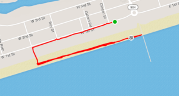

Saturday, July 21st -- another chance for DR dudes to get after it at OIB

Pax of 4 arrive at the pier for a 0630 launch. Some thoughts on a straight run, but by the gathering we opted for a solid sand-based beatdown hosted by YHC. On hand for the occasion were YHC, Denali, Dean (from Kernersville) and Salt Life (quickly becoming an OIB reg-U-lar).

[Here's where we went](https://www.strava.com/activities/1717120241), thanks to space tracking:

Warm-up:

- Run down the street, hook a left at an access point and get on the sand for Good Mornings, SSH and Imperial Walkers. Denali took his shoes off...

Thang 1: In honor of the OIB OG, traveling Jack Webbs from 1-to-10 and then back down 10-to-1

Thang 2: Set of 7's as called by Denali with LBC's and Lt. Dan's (called by Dean)

Thang 3: One of YHC's signature moves the 10-to-1 quick hit, on this day we did Merkins, Squats and LBCs

Mary lead by Denali and we're out

COT: Hello Kitty, Denali, Dean, Salt Life

Prayers for Salt Life's church community and YHC took us out

NMS:

- Tclaps to shoe-less Denali, rocking the entire sand workout sans footwear. Classic, "Shoe-less Joe Denali"
- Best AO in the nation!
