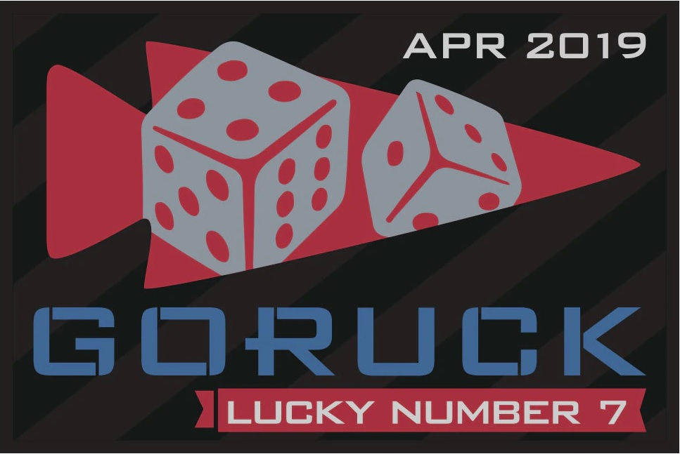

HotCakes either catching his breath or getting distracted by a shinny object.  

  
After the beatdown from ThunderstRUCK on Wed, 4 PAX continued the bruising at Rolling Stone 4/5/19 with GoRuck Lucky 7 WOD #3. All this, to score for a sick patch:  

  
1 mile-ish ruck north on Louis Stephens Dr and back-tracked to the soccer fields behind the elementary school. After determining that the ground flags were barely visible in the dark, a few soccer nets got moved around to serve as 25 meter markers.  
  
1 mile Ruck  
10 Rounds of  

- 50m Suitcase Carry
- 10x Ruck High Pulls
- 25m Bear Crawls

Late returning back to the COT with Gran Torino crew.
