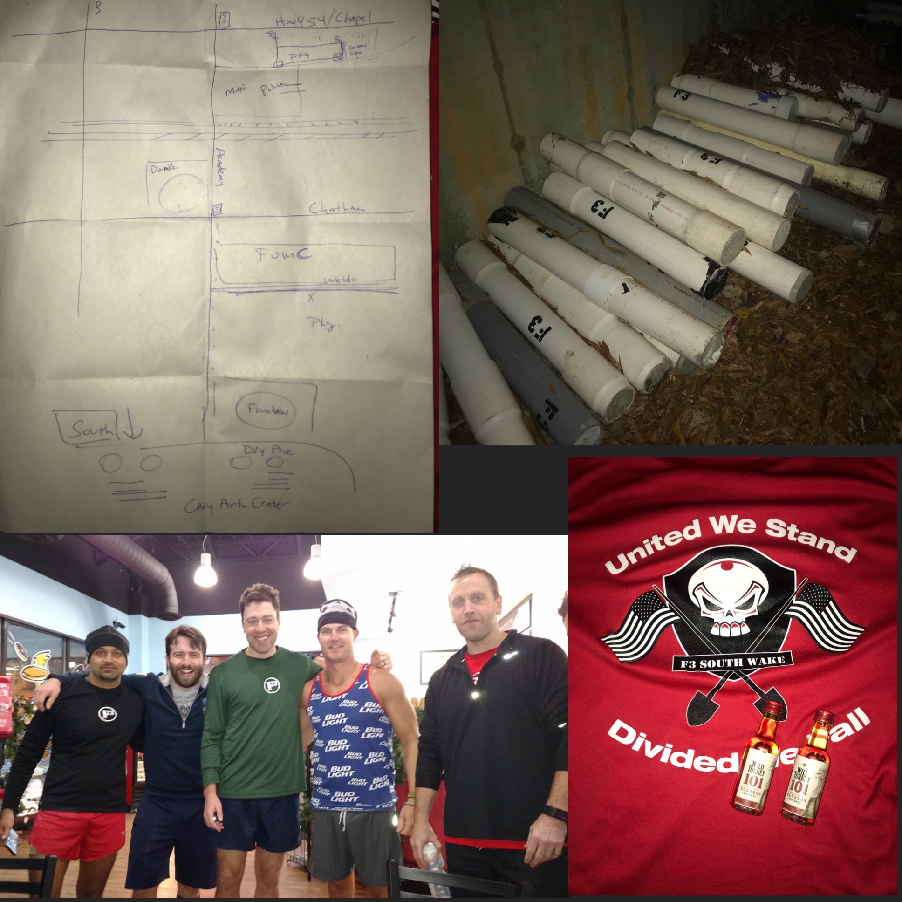

Q:  Captain Insane-o (KD Pax from F3 Louisville; YHC)

Pax (21):  Term Paper (respect), Yoga Mat (respect), Theisman, Emeril, Disco Duck, Angry Elf, Riptide, Shut In, Chinese Downhill (respect), Picachu, WKRP, Hermès, Midget (for Life), Sliderule, Banana Seat, Burt (respect), Half, Calllahan, Highlighter, Cody (respect), CI

Conditions:  36, nippy, clear.  Gear (for F3 Louisville Zoolander):  Bud Light Tank Top (smedium), gloves, shorts, skull face doorag, lady’s socks, running shoes.

I woke up 5 minutes before my 0450 am alarm, and jumped in the Jeep Patriot to head down to Bradford’s Ordinary, the self-proclaimed Best AO in Raleigh-Durham.  I had HC’d to something called the Meow Mile, which started at 0530, and I figured it would be a good way to warm up since I was wearing the only tank top I have (in honor of Tank Top Thursdays (TTT) a little something I may steal from BO going forward) and it was still under 40 (it had swelled to a balmy 38 degrees by this point).  I learned why it was the Meow Mile (you’ll need to post to get the story), and I was also told by no less than 5 Pax that BO is, in fact, the best AO in the world.  Well, no pressure.

We jogged back to the shovel flag (I think the J is silent), and I met the Pax, including Burt.  Now Banjo (who was absent for good reason) told me I had to meet Burt.  Burt had props.  A bag of tank tops for the shirtful, a fifth of Maker’s Mark, two travelers of Kickin’ Chicken 101 and a Louisville Slugger baseball bat.  Part of me was flattered; part of me was concerned.  Was the bat a threat if my Q was bad?  Let’s find out.  Here’s what went down:

**COP:**  Top to Bottom

All IC:

20 SSHs

20 IWs

15 Merkins

15 LBCs

COP is normally not a challenge, but between Hermès counting 9 on 3 and waking up the neighborhood and Midget’s “shorts”, YHC was a little thrown off.  I regained composure.  But the Mumblechatter was powerful.

Name-o-Rama Circle Burp.  Say F3 Name, all Pax do a burpee.  We did this 21 times.  This way I can at least get a couple of names out of the 21.

**The Thang**

Partner line run to the Parking Garage, with YHC calling HOLD and an exercise.  We did burpees (5), Mountain Climbers (15), Jump Squats (20).

Now, I’m going to tell you a secret. Banjo is a baaaaad man.  He drew me a treasure map.  And X marked the spot with the Pain Sticks.  So, I reworked the meinke (mental weinke) to add a modified Louisville Honeypot work out.  The Lousiville Honeypot is a coupon bear crawl, partner workout.  You basically drag the coupon while you bear crawl.  Figure it out.  Pain Sticks will work just fine.  Uhhh, well, those things weigh between 40 and 50 lbs.  But we did it anyway.  Partner Up with Pain sticks. Louisville Honeypot Dora. 100 merkins/200 Lbcs/250 squats while partner goes up in Honeypot and runs, jogs, walks back yolking the Pain Stick. I’m not going to say I saw some guys rolling the pain sticks cause that wouldn’t be cool. But....  Plank for the six.

Whoa, time is moving fast.  OYO Tabata run back to the flag.  20 seconds (count to yourself, Hermès) full sprint, 10 second jog (silent J), 20 second sprint, 10 second jog.  Love that the Pax went back for the Six.

**The Finisher**

Mosey to the parking lot for Build-a-Bears.  Not going to brag ‘cause I’m sure this isn’t new, but this is my thang.  At the end of a parking line, 1 body builder (isolated burpee with a plank jack for good measure), then bear crawl down, around and back up the next end.  Repeato until time was called. I heard numbers tossed around like 21, 22, 18.  Not bad since a normal parking spot is 9 feet wide.  Do the math.  Mosey back to the flag.

**COR, NOR, COT.**  Lots of announcements.  Active group.  Two Christmas Parties, a Raleigh 2F lunch on Friday at PR that I’ll miss (sorry Burt), Toys for Tots drive. More than I can remember.  I’m sure there’s a website.  Intentions were stated and the weight of it carried through the group.  YHC said some words, and I appreciate the Pax listening to my oxygen deprived rambling.  In short, a fun time, great two days, and a real eye opener as to how truly amazing F3 is.  BOM and Hermès took us out with intentions to the Sky Q.

**Postscript** 

When we broke, the mumblechatter turned down to reveal a wonderful group of men.  Not only did Burt not hit me with the baseball bat, he gifted me the two KC 101s (although I wanted that Ronald Reagan TT).  Fist bumps, high fives, brotherhood.  Then off to Duck Donuts for 2F with BO guys and the South Wake Pax who filled up a clown car.  I won’t take Midget’s criticism to heart, but I will promise to melt his face the next time we meet.  All in all, a great morning with great men getting better.

Thank you for hosting me and giving me the shot.  I appreciate it more than you know.

 

CI out to catch a plane.  And yes, I’m checking two Pain Sticks back to F3 Louisville.

