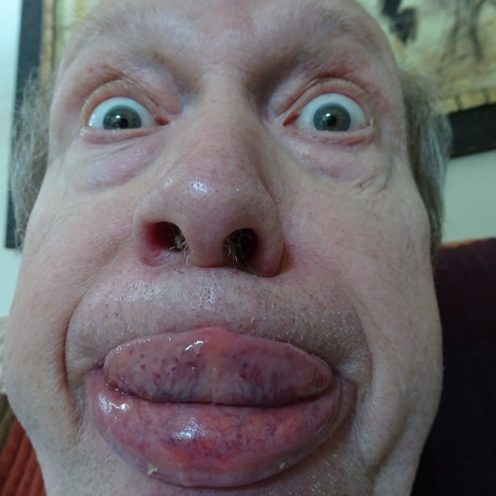

So for some strange reason YHC signed up to Q this morning. The day after running a 1/2 marathon. Not the best plan, but at least Hell's Bells is typically limited run. Also, YHC does not typically post at Hell's Bells, but I've been around long enough so what the hell? Here's what we did:

**Warmup:** No FNGs. Mission statement and pledge and offff we go for a mosey around the parking lot and up the street. Circle up for:  
SSH x 15 IC  
Good Mornings x 5 IC  
Sir Fazio Arm Circles x 10 IC  
Seal Claps x 10 IC  
Imperial Walkers x 10 IC  
Plank Jacks x 10 IC  
Calf Stretch L/R x 10 silent count each side  
Copperhead Merkins x 10 IC

**Tha Thang:** Everyone grab a bell and circle back up. Here's "roughly" what we did.  
Tricep extensions x 10 OMD  
Goblet Squats x 15 OMD  
Curls x 20 OMU  
Repeato  
Mosey.  
Merkins on the bell x 10 OMD each side  
Thrusters x 10 OMU  
Repeato  
20 KGB Swings OMU  
Mosey.  
Copperhead Squats x 10 IC  
Rock your body x 10 IC  
Curls x 10 IC  
Repeato  
Mosey.  
There were a couple more rounds, but you get the idea.

**Mary:** LBCs x 10 IC w/ bell  
E2K x 10 IC (L & R)  
American Hammer x 10 IC w/ bell  
WWII x 10 OMU w/ bell  
Supermans x 10 IC  
Have a Nice Day

**COT:** Bring diapers to Ragnarok this week for Tang's forthcoming 2.1. See slack for what size you need to bring. All prayers and praises were silent this morning. YHC took us out.

**NMS:** Was this my best Q? Probably not. But kettle bells are not my strong suit but I chose to get outside my comfort zone and lead some men in a beatdown. I hope they felt like they got a decent workout. At the very least everyone got their monies worth! I appreciate the opportunity to lead everyone this morning. MIAGD!
