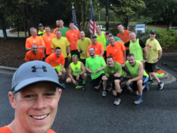

 

22 brightly clad HIM gathered. Very light drizzle. No FNGs but disclaimer still given and we are off.

**Warm Up**

Parking lot lap

SSH x 15

IW x 10

GM x 10

Burtjacks x 10

 

**The Thangs**

Mozy down the trail to field loop.

Partners run in opp direction, 20, 15, 10, 5 partner clap merkins when you meet up

 

3 sets of 12 IC each chest, legs, core exercise

½ lap between each set.

Merkins, squats, lbcs

Wide grips, monkey humpers, LSF

Diamonds, lunges, homer to large

 

Mozy to large hill farther down the trail

7s with burpees at the bottom and double merkin burpees at the top

 

Double applesauce IR to shelter

Dips, irkins, derkins x 12 IC

 

**Mary**

Didn’t happen

**Announcements**

Hi-Liter grateful for his F3 brothers

Chinese Downhill has the Whiplash Q

**Prayers**

Burt’s BIL John

Loom’s Daughter

**NMS**

Incredible site to see almost everyone had gotten the memo to wear neon. Props to Burt who, as he does on Thursdays, brought extra shirts, and all PAX were clad in bright colors as we started.

It was a small gesture, but we could all tell that it meant a lot to our Brother Hi-Liter. Glad to see SWW and DP delivered as well.

Probably good that the rain held off, because the playlist I had quickly prepared for a full shelter workout had a lot of explicit language and today wasn’t the day for it. It may come out at some point.

Apparently, Shut-In and Flacco both left their gloves attached to the door of the port-a-john?? Is there a story here? Nice work Banjo on the recovery.

This workout was harder than it seemed when I planned it out. Finishing with hill 7s and the run back, which is largely uphill about did me in. At least 3 of us started in the tempo IR group but quickly realized that we had made the wrong move.

Thanks to Chinese Downhill for taking us out.

Good thing we had the Odyssey last year, or I think Carpex may have been short some neon gear today.

I need to get a watch. It has gotten harder for my kids or M to lend me theirs when I Q. Thanks to those that helped me with time checks. You were many.

I love all you guys and am so grateful that for what we have.
