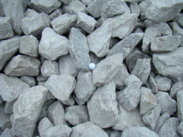

So it is another fine day in southern Cary and how else should we start other than with nice cold 5:30am exercise with 12 PAXs.

**Warm Up**

It was cold, well at least I was, so we ran from flag toward park and did two laps so we would not be too cold during warm up.  Then we started with 12 Good Mornings because the Q was having trouble breathing and counting at the same time and did not know when to stop.  Then 15 Merkins, followed by forward and reverse arm circles. Then the Q got lost again trying to keep cadence on side saddle hops and we went until the laughing stopped. Then Yoga Mat called some Imperial Walkers while the Q recovered.

**The Thang(s)**

It was a dark morning, and no one had head lights so we  ran to Cary Parkway and ran up the hill stopping at each light and doing 10 Merkins. Going back down hill we stopped at each light for 10 squats.  We then returned to the park and picked partners and rocks.  We then did a Dora with partners consisting of:

100 Curls

100 Triceps extenstions

100 Military press

100 Rock Rows

100 Squats

Meanwhile the partner ran two laps around circle.  There was much debate over one lap of two laps...  Term Paper did the statistical analysis and determined that 1.5 laps was correct, but we did 2 anyway.

**Mary**

We ran back to flag and then did PAX called Mary's:

20x Freddy Mercury's

10x Boat Canoe

10x Box cutters

10x LBCs

Then we had a good day.

**Payers/Praises**

A prayer request was made for Yoga Matt's friends family who were going through a tough time and we ended a few minutes early with Lite Brite taking us out.
