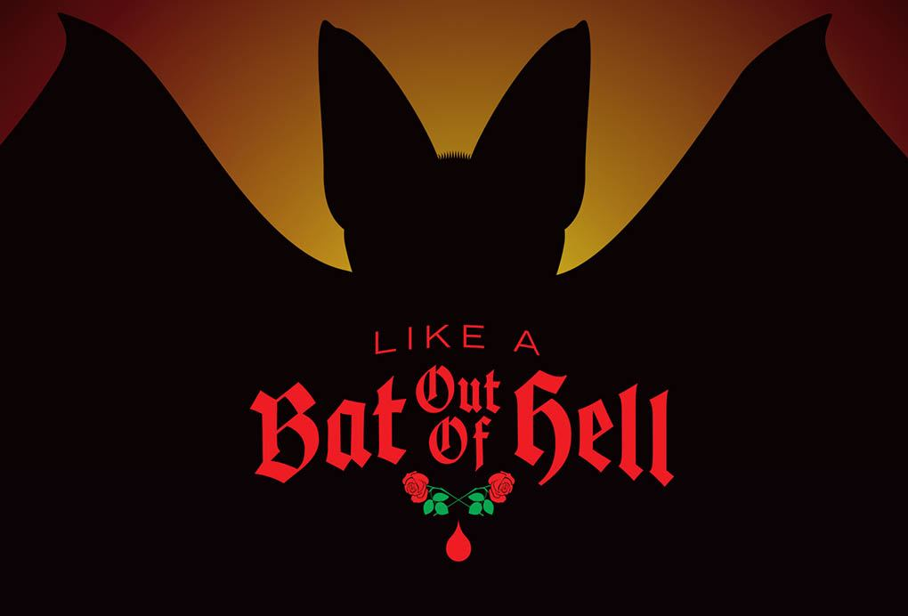

**This YHC celebrates a 1 year anniversary with a Bells Q right where it all started. Enough about that!**

My playlist was off this morning not knowing the entire Meatloaf family would make up for a 1/3 of the morning PAX. Once the Meat wagon arrived we began on-time as always. Disclaimer, Pledge and of we went about 6 feet away.

Morning Warm-ups included KB Hamstring Stretch, Good Mornings, Sir Fazio counter and clock with some seal claps. Mumble chatter was light even with @Frisco and @Earhart. Now that the hams and shoulders were warm, we picked up the bells and headed down to the Pickle for some 2 out of 3 ain’t bad.

**THANG 1**

### **Split into two groups of about 9. On the bridge one group did KB Swings while group 2 hung onto the pull up bars and did 10 Knee raises. This created quite a buzz and the Q delivered with a demo. Round 2 included 20 TGU (with groans) and 10 Chin-ups**. TGU were present for my first post see June 4th 2018 if you care. Okay... Round 3 included 20 Thrusters and 10 Pull-ups. Since we had some time... we repeated:)

THANG 2

### **Now that we had everything warmed-up we headed back toward the flag for a quick partner “Catch me if you can” “I would do anything for you” with Partner 1 two KB Lunge around the half pickle.**

MARY

To Earhart’s dismay we had little time for Mary and I took this opportunity to stretch the pax “Paradise By the Dashboard Light” with some Hip stretches, Pigeon Pose , Homer To Marge and LBC’s.

COT

Crazy Train coming next weekend The Green Mike soft launch this Saturday. Prayers for the Gonzalez family
