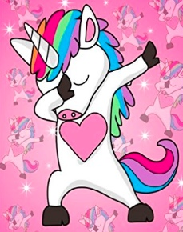

December 31, 2018

AO: Hells Bells

QIC: Frisco

PAX: Ashbury, Earhart, Kubota, Meatloaf, Monkey Nut, Milton Bradley, Rooney, Shut In, The Joker

As I was driving in this morning with the hard core sounds of Fight Song by Rachel Platten blasting it occurred to me that I hadn't thought up a name for my 9th VQ workout. Then the radio jockey mumbled something about "goes together like unicorns and glitter" and the Frisco mental juices began to flow.

5:20 PAX start arriving and YHC starts counting to make sure there is an even number. Unlike a You-Can-Ring-My-Bell or It's-Raining-Men workout, Unicorn-and-Glitter workouts require an even number of PAX or they quickly degenerate into a Hi-Liter Q (i.e., "um...let's do another 500 of that exercise we just did 1,000 of...") and I can say that since I know he won't read this BB ;). It was touch and go with PAX apparently clown car-ing (clown caring?) in just to be at the 5th Frisco VQ but finally we had an even number of PAX. I was still on the fence about whether a unicorn and glitter Q was the best way to end 2018 when I overheard Rooney mentioning something about wanting to have his new school's mascot be 'the unicorns'. At Q school Ma Bell said "Don't look a gift horse in the mouth before you kiss it" (or something like that) so I decided to let Fate have its way, grab the 'corn by the horn and get smackin'.

**Warm Up**

Quick mosey around the pickle and flag circle near the shelter to ensure the Strava map photo would draw the body and head of "the unicorn"

Sir Fazio Arm Circle Thingees (Front & Back)

SSH (enough to make Earhart threaten Site-Q revolution)

Merkins (called 10 but mumble chatter about "knowing the amount up front, wah wah wah" and Shutty counting from 10 down sent us into the negative numbers until either he apologized for his temerity or the Q's arms gave out! So we stopped at -5 because YHC could tell Shutty was apologizing silently in his mind.)

It was time to start the Thang when Monkey Nut threw his 5 lbs kettle bell into the woods and declared "I'm going for a run. Put your uni-horn where the sun don't shine, Frisco!" Or he may have said "My shoulder is still out of commission so I'll just run and come back for Mary." The two statements have a lot of the same letters so they are practically interchangeable.

I counted the remaining PAX three times and 2 out of the 3 times came up with an odd number. But like Liverpool says "Don't look a gift horse in the mouth before you kiss it" (or something like that). I was committed and once I hamstringed the Joker with a kick to the shin (I could see he was considering developing a shoulder injury, too) it was time to start the Thang.

**The Thang**

Partner up, size probably doesn't matter

P1: Bear Crawl around the flag circle

P2: Squat and hold the kettle bell out in front of you

Flapjack and then when each partner has gotten a trip around the flag circle:

Kettle Bell Jack Webbs 1:4 ratio (was supposed to include putting the kettle bell down and doing falling glitter/jazz hands each time, but one look at Earhart's face let YHC know that jazz hands--especially _glitter_ jazz hands were not welcome at HB)

Repeato with alternating lunge walks & bear crawls on the flag circle (after Shutty faked a pinky injury I had to alternate especially without the glitter jazz hands to restore his circulation in between sets).

We swapped out squat-and-holds with tricep extensions, curls for girls, goblin squats and KB arm raises with increasing Jack Webbs.

**Mary**

Around the 5th Jack Webb set I noticed Monkey Nut come out from behind his truck where he had been hiding and pretending he was running. I had the PAX farmer carry the KBs back to the circle to meet him. We arrived right as he was dousing himself in fake spray-on sweat. To let him make up for his absence (and because I forgot how much the KBs can take out of you) I turned over Mary to him.

Russian Hammers

Freddie Mercury (with Kettle Bell)

Hello Dolly (with Kettle Bell)

Low Slow Flutters (with Kettle Bell)

Dying Cock-a-Roachs (with Kettle Bell)

**COT**

Count-a-Rama: 8 Mehs and 2 Hates

Ausfahrt's M has an update on his status on the CaringBridge website and also gave a general visiting time (between 4pm - 8pm). BUT check the website on the day you plan to go since it looks like she may also be posting preferred times for a specific day: https://www.caringbridge.org/visit/ericneumann2/journal

_He can have visitors but they suggest it be between 4 pm and 8 pm because that's the only time they definitely won't be working him.  He's on the 3rd floor, 3C02.  You can take the A-B elevators._

**NMS**

We talked about the need to be diligent watching out for our brothers in the gloom. Dark Visor passed away at a workout in Georgia, Digits in SC is the second loss down there in a year, Banjo had a story earlier in the year about a PAX in Raleigh collapsing and needing assistance.

If you read the posts of Ausfahrt's M on Caringbridge you'll see a narrative of strength in the face of enormous pain and a long, long road to recovery for both of them. Support can come in a lot of ways (i.e., Hermes picking up Ausfahrt's lawn with the other CaryingPlace PAX, getting Crimson out for 2nd F, visiting Ausfahrt in the hospital, etc.).

Being our brother's keeper goes beyond just picking up the 6 on the runs, crossing the street and making sure we are safe during the workouts. We have members out on IR that eventually will return to the gloom, but we want them to do it safely since the natural tendency is to push. Be willing to pass on a workout and instead just do a fellowship walk with one of our returning IR brothers or Q a bruisers to get them back in 1st F. Do an EC run or ECP if you are worried about getting in your own steps. Let's make sure at least one or two PAX or site Qs are carrying a phone on them in case we need to call 911. Be the last to drive out and don't leave until you are sure everyone's car is starting.

It was an honor to lead you all this morning. Make is a great New Year!
