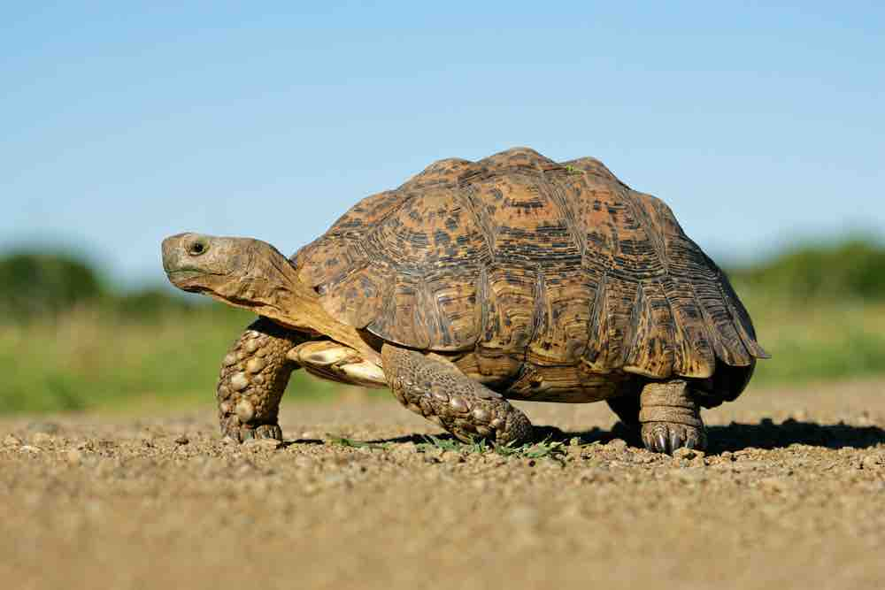

13 Tortoises gathered at Cornerstone Fellowship Church on a beautiful Wednesday morning ready to work. Rolling in hot from the street at 5:25am was C25K Shieldlock members Bolton, Roasters, and Left Cheek who just killed a 3 mile EC run. Billy walks up and I haven't seen him for years so it was great seeing that kneebrace & his beautiful face (despite his distaste for all day work Zoom meetings). 5:30am hits with YHC perfectly executing the F3 mission, disclaimers, and first exercise: The Pledge. My Monday A-Team Q-School teacher Imp was already nodding with approval. The PAX moseyed to the front of the church for a warm-up.

## Warm-Up

Good Mornings ICx10

Imperial Walkers ICx10

Sir Fazio Arm Circles (both directions) ICx10

Cherry Pickers ICx10

YHC gave directions about how the workout would be structured. With this being Carpex Culture Month I made mention that I like my Qs to have the PAX exercise together. There would be modifying options but you'll always be in plank until the Six is in. No down time. Then we exercise together.

## Thang 1

Run the pickle (or walk halfway and down the mini steps), plank for the Six

25 Merkins OMD, 25 LBCs IC

Run the pickle (or walk halfway and down the mini steps), plank for the Six

25 Carolina Dry Docks OMD, 25 Freddie Mercs IC

Run the pickle (or walk halfway and down the mini steps), plank for the Six

25 Squats OMD, 25 Homer to Marge IC

Run the pickle (or walk halfway and down the mini steps), plank for the Six

25 Wide Grip Merkins OMD, 25 Dying Cockroaches IC

Run the pickle (or walk halfway and down the mini steps), plank for the Six

25 Mountain Climbers IC, 25 Leg Lifts OMU

Recover and mosey to the pull-up bars

## Thang 2

Plank for the Six

On the grassy hill, all PAX face the pull-up bars. As one HIM does 5 pull-ups, everyone else does Never Surrenders OYO, while also encouraging whoever is at the pull-up bar. Each PAX gets a turn as Never Surrenders are completed (with some Hallelujahs thrown in too) while pull-ups are happening.

Mosey to the wall

## Thang 3

PAX line-up on the wall for Wall Sits while pairs head to the benches for:

10 Dips

Back to the wall. Then repeato with:

10 Irkins

Back to the wall. Then repeato with:

10 Dirkins

As PAX are doing Wall Sits, each one describes how they got their F3 name and generally getting-to-know-each-other (Wall Sits include arms up and arms in front). Loved the origins for Roasters and Quiver. This all sucked.

Mosey to the flag.

## Mary

Everyone in plank hold for the last 4 minutes. YHC asked PAX to think about their day and how they were going to impact their family, community, or work to make it a great day. Lots of great intention for the day including: Left Cheek mentioning providing tasty Lays chips to Elmdale (I think that's near Schitt's Creek) with a smile, WWW is going to be intentionally present throughout the day, Bolton was going to complete three projects on his to-do list, Zamboni is starting a new job and wanted to be sure his old team is well prepared & equipped for his departure, YHC is coaching 9 year old flag football practice tonight, and so many more great answers!

Last exercise is Have A Nice Day

## Announcements/Prayers/Praises

Lots of prayers including celebrating new grandchildren, courage in cancer treatments, recovering health, and more.

It was an honor to lead today. I mentioned I'm 3.5 years into F3 and I don't Q a lot. Always felt like my contributions were being a site Q at Bounty Hunters & Winterfell. But recognize I should be leading more workouts. Thanks to these HIM who walked along side of me this morning and constantly push me to get better. I'm truly grateful.
