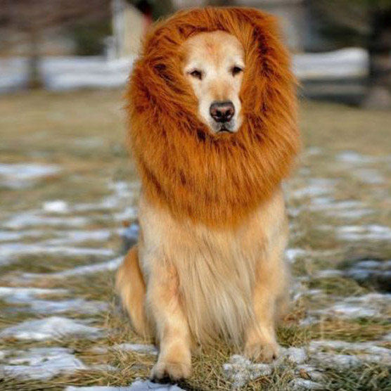

Monday morning. Kryptonite for some men but not for these 11 dudes. No gloves for the real men #carystrong and off we went.

COP in the VIP parking lot - SSH, Mountain Climbers, Good Mornings, Merkins, Imperial Walker.

**Main Event - 3s by 5**

Practice the 3s by 5 - 5 Starjumps, 5 Burpees, and 5 Hand release Merkins in the parking lot and then run to the corner of Ederlee Drive and Regency Parkway.

Run to the greenway entrance at the corner of lake entrance and do another set of 3s by 5.

Run to the entrance of Lions Gate Drive - do another set of 3s by 5.

Run the entire length of Lions Gate Drive (down and back) and do the 3s by 5 set after each rotation (total of three sets).

Partner up - Run the lollipop up Peregrine Place doing Catch-Me if you can (10 LBCs each exercise set).

Indian Run (teams of threes and fours) to the bridge around Symphony Lake.

Bridge - Irkins x 15 and Derkins x 15

Indian Run to the backside of Koka Booth

Grass Steps - 20 Left/Right Step-Up and 15 Dips x2.

Indian run to the VIP Parking Lot.

Two times around with Catch-Me if you can and a quick Mary (Freddie, Box Cutter and 5 second around the circle leg hold).

**COT**

**Moleskin:**

\-We ran about three miles. Largemouth was disappointed but everyone else went away satisfied. -The street names and subdivision names around Regency Park are epic. Avenues of the Estate, Lions Gate, Venetian Court, Michelangelo Way...you can't make that stuff up. Who that those names were a good idea? -PetSounds thought we weren't going to run when I did the practice 3s by 5 in the parking lot. Wrong brother. We run at Kryptonite. -Shut-In wears two shirts. One for warmth and one for his areloas...ask him about them. Ha. -FreeBird stole Michelob's car. Okay, I'm making things up now but not about the last comment.

**Announcements:**

https://f3carpex.com/category/f3/misc/announcements/

**Prayers**

Zero. Prayers for unspoken prayers.

Thanks for the honor of leading this morning. Until the next time. Denali

