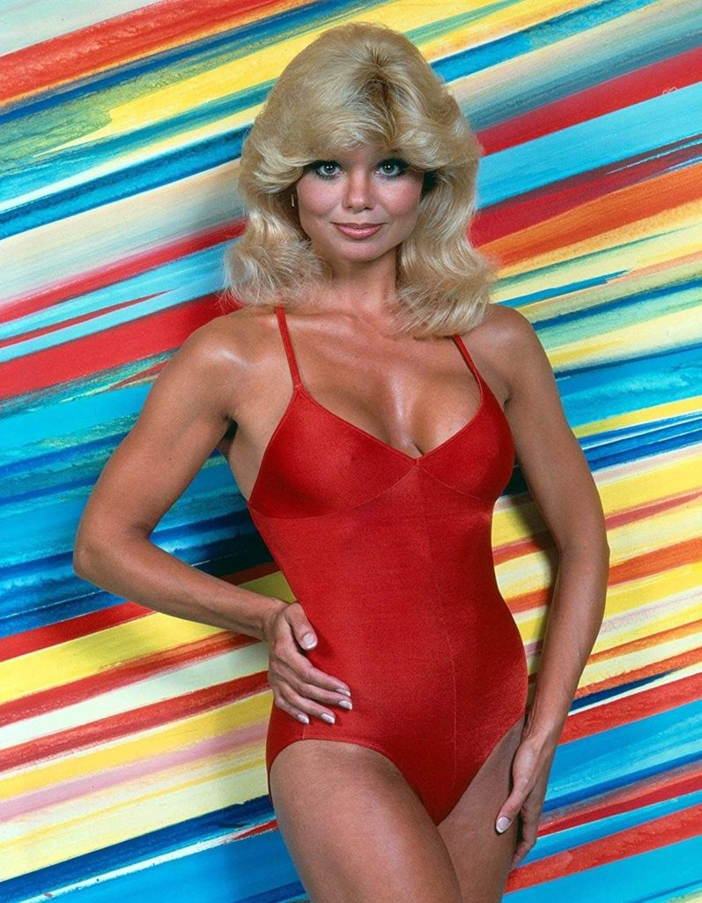

This is the  kind of morning we are having.  Extra Crispy shows up to SNS after a 2 year hiatus.  Burt introduces himself as Burt Reynolds.  ViewMaster comments that he once worked on Burt Reynolds' horse farm in Florida and got to hang out with Lonnie Anderson.  Burt has a minor cardiac event at the very mention of Lonnie's name.  I have to stop Burt from helping himself to Coffeteria before the workout starts.  This all transpires in 45 seconds before we even get to the pledge. 

No FNGs. Just the Kotter from Extra Crispy.  Pledge.  Mosey through the park to the boathouse parking lot.

- 7 GM IC
- 25 SSH IC
- 15 Imperial Walkers IC
- Calf Stretch
- 15 Merkins OMD
- Calf Stretch
- 15 Merkins OMD
- Runner's Stretch

During the warm-up we learn that Callahan apparently hurt his groin earlier this week while "sitting down after the workout was over".

Next exercise is 7's.  Squats at the Boathouse and Big Boys on the top of kiosk hill.  Also do 10 Merkins every time you pass the kiosk in either direction,   

We end at the top of the hill and then mosey across the street to the rock pile for a rock Dora with 100 Curls / 200 Overhead Press / 300 Rows and a full parking lot pickle run.

Mosey back to the flag and circle up for LSF IC, H2M IC and a Chilcutt minute to finish.  Announcements include a VQ on Friday for ViewMaster at DZ, Convergence on July 3 and TCP Sawgrass this weekend.    Also VHS is making a zombie movie, and he needs extras so get at him if you are interested.  I legitimately did not make that up.  Praises for Henrik's fifth birthday.  Prayers for Staubach's Dad.  VHS took us out.

Also, Callahan brought Collector's Edition Muggo Mugs!  Incredibly meta moment.  I'm fired up that I got one.
