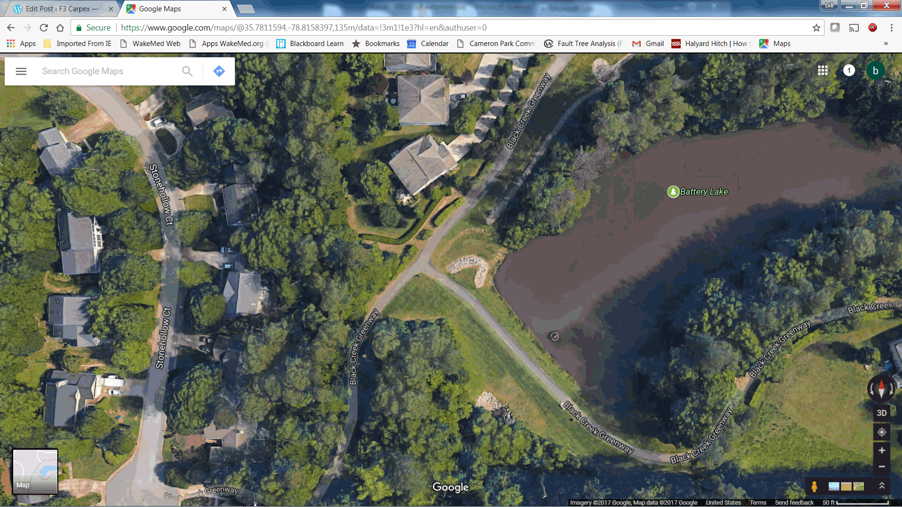

After a very long hiatus from Carpex F3 posts, Hotspot egged me on by stating that he and Hasslehoff were doing an abbreviated Insomnia, followed by Vesper, and asked if I wanted him to take the Shovel Flag there for me.

Smack.

So YHC HC'd to the double down.  After a brisk (7'45"/mi) 4+ miles, I wrung (is that a word?) out my shirt and knew I was in trouble.  Had called the route for Vesper long as James Jackson, the hard way, last night on the Groupme.  The run groups formed up, and at 0545 (yes Term, it was 545) off we went.  The PAX formed into 2-3 smaller groups with Michelob and Denali strongly heading off the front, soon leaving YHC behind on James Jackson.  Then Largemouth came roaring by.  Walking commenced (dang dodgy hip...oh that and being out of shape).

As I rounded the curve onto Maynard, I knew I was in trouble.  Made it up to High House, and decided I felt good enough to continue along the greenway.  Apparently I did not, as I got confused  at this spot...

See that T?  I was coming along the path that says Black Creek Greenway, from the upper right, and should have just kept on running straight.  But I turned left, and ended up circling Battery Lake.

Gassed.

So, it was a nice walk back up the other side, rejoining High House Road eventually, and slogging it back solo, to arrive just as COT was wrapping up.  And all other Vesper runners had been back for minutes.

Large did confess at the end of COT that he circled back looking for me.  Thanks Large.  Makes a fella feel special.  No one else appeared to notice I was missing (guess that says something to how often I've posted over the past few months).

Great to see how strong you runners are these days.  With 2 weeks to go before BRR, things are looking dire for Old Maid.  Hope to see y'all next week.  Sound off if I missed you in the tags...will edit/update as needed.

OM
