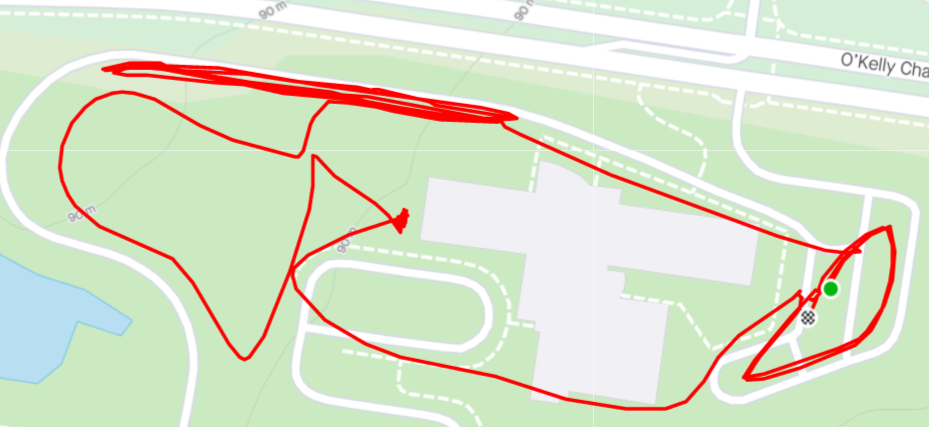

**AO:** Wild Wild West  
**Workout Date:** 07/26/21  
YHC is starting off my birthday Q week at Wild Wild West. I was inspired with a workout variation last night, but with only eight PAX for the workout, I decided to shelve it for later. PAX might see it at Ground Pounder on Saturday.

**Warm Up:**  
State the mission, check for FNGs(0), and give the disclaimer.  
Pledge of Allegiance  
Mosey to the other end of the parking lot for warm ups  
Side Straddle Hops x20 In Cadence (IC)  
Good Mornings x5 IC  
Imperial Walkers x20 IC  
Sir Fazio Arm Circles forward x10 IC  
Sir Fazio Arm Circles reverse x10 IC

**Main Event:**  
**1) Number of the Beast**: Six reps of an exercise at each of the six parking lot islands. Repeato with a different exericse. Continue until six exercises have been completed. Squats, Little Baby Crunches, Merkins, Jump Squats, four-count American Hammers, Burpees  
**2)** Mosey to basketball court and partner up for **Partner AMRAP/suicides**. Partner 1 does AMRAP (As Many Reps As Possible) of an exercise while Partner 2 runs out to the far baseline and back. Flapjack, then hold for six. Repeato with a new exercise. Exercises were: Carolina Dry Docks, Carpex Sumo Squats, Flutter Kicks, Balls to the Wall (against the storage container), People's Chair, Australian Mountain Climbers, Nipplers.

<figure>

<figcaption>

[https://www.strava.com/activities/5689242103](https://www.strava.com/activities/5689242103)

</figcaption>

</figure>

**Mary:**  
Dolly x10 IC, Homer to Marge x10 IC, Rosalita x10 IC, heel-tap Freddy Mercurys x10 IC, Dying Cockroach x10 IC, maybe others. I opened the request line and we got Box Cutters x10 IC and Windshield Wipers x10 IC  
Stretching: Downward Dog and isolated heel stretches

**COT:**  
8 PAX  
  
Announcements:  
**1)** South Wake/Carpex Q Swap Week(s): Last week of July in South Wake, First week of August in Carpex. Wild Wild West will be part of the swap next week!  
****2)**** F3 ENC CSAUP Sasquatch is 7/31  
**3)** New SE Raleigh AO opens 7/31  
**4)** F3 NE Wake CSAUP The Deacon is 9/18  
**5)** Coffeeteria at Vicious Fishes  
  
Prayers for a daughter who lost her father. Prayers for PAX in Charlotte who lost his mental battle. Prayers for his family. Prayers for a wife recovering well after surgery. Prayers unspoken.  
Bootlegger took us out.

**Naked Moleskin:**  
Good work by all!  
T-claps to Tots, who is already on his fourth or fifth post after FNGing last week at WWW!  
Crimson had requested we fit in eighty-six merkins if possible. We did not, but YHC and Charmin stayed after to support Crimson getting his eighty-six for the merkin challenge.  
YHC could not do all eighty-six, but it looked like the support helped. Well done, Crimson!  
I was excited to bust out my Wild West-inspired exercise, but with only eight PAX it would be pretty brutal. If you are reading this, don't get too excited, but post to Ground Pounder and maybe find out. The featured image is a clue.  
Birthday means a new age to announce at COT! Unless you're Flush.  
I still said my old age.  
This was my eighty-second #F3Q21 #2021Challenge Q (eighty-fourth overall). Next Q is Tuesday (tomorrow!) at Cougar Town for my birthday week!  
\-Pigpen

**QIC:** Pigpen  
**PAX:** Schlitz, Charmin, Sooey, Bootlegger, Tots, Crimson, Two Scoops, Pigpen  
**Workout Date:** 07/26/21
