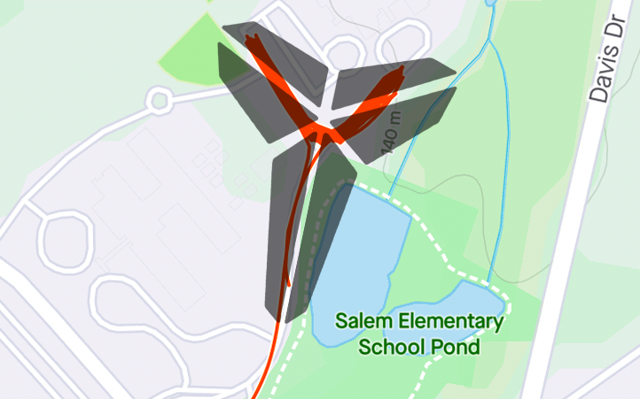

YHC wanted a chance to honor Kobe, his daughter, his family and those lost along side him in the tragic accident over the weekend. So, a high tempo 8&24 Mamba Mentality beatdown was in order at FMJ... and whattya know, 8 pax were there. Coincidence, I think not.

Warm-up:

- On our way down the road stop for GM (8), SSH (24), Sir Fazios (8&8)

The Thang:

- At the intersection partner up.
- One partner runs the split to the right, the other to the left.
- SET 1: At the end 8 Kobe Burpees (jump shot) and back together for 24 partner merkins x3
- SET 2: At the end 8 Kobe Get Ups (Turkish with a jumper) and back together for 24 partner squats x3
- SET 3: At the end for 8 CDDs and back together for 24 seconds of partner BTTW
- Use the rest of the time to take the pax back-and-forth from end to end for a combination of those exercises we did before
- Mamba Mentality hustle back to the flag for some Mary

Mamba out!

RIP Kobe, Gigi and those lost
