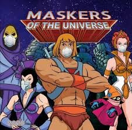

6 of the usual #ao-carpex-maskers-of-the-universe PAX showed up this foggy morning. The shovel flag was planted where the usual Point Break pitchfork flag is placed, but the island didn't seem to mind. Teen-drive Ashbury thought about doing donuts, but decided to park at the far end of the lot instead.

No FNGs, said the pledge, then moseyed down the road to the parking lot home of the essential worker in the small blue sedan that shows up to work before 5:30AM every day.

Warmups featured Good Mornings, SSH's, Sir Fazios, Fazio Sirs, and maybe Seal Claps, but I my memory, like the weather, is a little foggy.

Partnered up for a Dora of merkins, squats, and LBCs with a mask-friendly pickle of about half the parking lot. That didn't take too long, so we made our way to other end of the parking lot by bear crawling and lunge walking between islands (alternating at each island).

Much to everyone's delight, we picked through the bushes down to the rock pile for some mid-to-ego sized coupons.

Another Dora was in store, this time with curls, triceps, and rock-rows. slightly longer pickle from this end.

While we waited for the six to finish the pickle we all assumed the "Teenage Driver" position, holding our coupons straight in front of us like a steering wheel for about a minute. it was as fun as it sounds.

Dropped the rocks back where we found them then a quick mosey back to obnoxiously well lit parking garage for balls to the wall with two ten-counts from all PAX present (youngest to oldest, then back down to youngest).

Mosey'd back towards the flag for Mary with a stop at a curb for some step-back lunges.

Mary was American Hammers, low-slow-flutters, and LBCs, I think. It was foggy.

Standard announcements, praises to the guys that ran the Pilot Mt. Ultra and finished top 20, voting is important and half the PAX present were old enough to do it.

Another good morning with the maskers.

