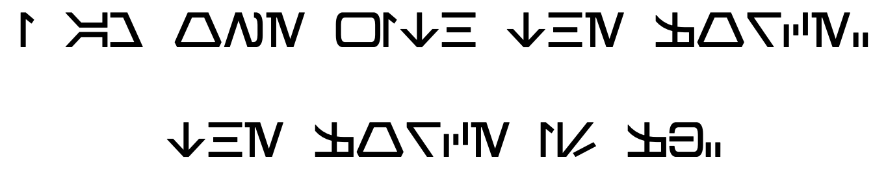
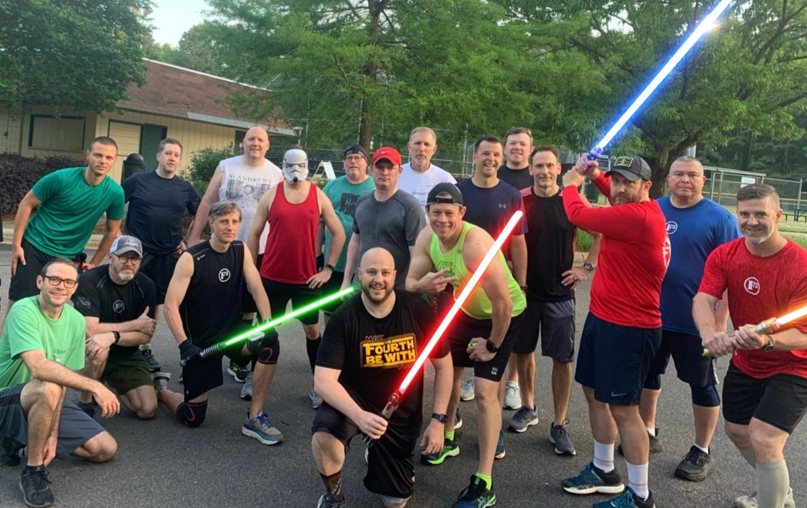

Disclaimer. Pledge of Allegiance. 

(This Backblast is long....)

**Pre-Thang**

**A Long Time Ago in a Galaxy Far Away….**

**May the 4th CARPEX Light Side vs. Dark Side Challenge**

It is uneasy times in galaxy. The Galactic Republic is a memory and the Empire has taken its hold over everything. Emperor Palpatine has charged Darth Vader to send a team of Imperial Stormtroopers to collect Kyber crystals that were stolen by Bounty Hunters and that have been lost on the plant Endor. The Rebel Alliance have intercepted the transmission on the Empire’s plans and have dispatched a team of Rebel’s to secure the Kyber crystals before Lord Vader's squadron of Stormtroopers can get to them first. Who will secure the Kyber crystals...The Light Side or the Dark Side? 

**The Thang** **(Cue Star Wars Montage)  
**  
PAX count off and divide in half. Each group chooses a Squadron leader(s). 

The Squadron leader(s) gets a Mission that leads to another clue and a task, then another, etc.  Each squadron had to use the following map:

## **The Light Side Mission Log**

**START: Welcome to the LIGHT SIDE!**

The Galactic Republic has fallen and the Empire is on the rise. Your team of Rebels have landed on Endor at a new Imperial Outpost and have been tasked by Mon Motha to secure as many refined **BLUE, GREEN, YELLOW or PURPLE** Kyber Crystals that were lost by Bounty Hunters here on this planet. You must do this before the Empire Finds them!

Now head to the  Rebel Outpost (1).

**The Rebel Outpost (1)**

The Imperials are on the move. You must secure as many BLUE, GREEN, YELLOW, or PURPLE Kyber Crystals as possible before they take them. Find the one in the bunker. 

Before you begin, gather all of the cadets and have each person do 50 **Imperial Walkers** in cadence then move on the Northern Outpost (10) (Look for a Bench). You may be able to hide from the Empire there while you get a plan together to find the crystals. 

**Forest: Northern Outpost (10)** 

No sign of any Imperial Troopers. 

Shhh…there are Ewoks near. You can hear them. Scare them away and have the cadets do **50 Jawa Humpers** (Money Humpers). 

Once the Ewoks have fled, find a BLUE, GREEN, YELLOW, or PURPLE Kyber crystal and then quickly get to the Southern Outpost (12) where there may be more Kyber crystals (look for a bench)!

**Forest: Southern Outpost (12)** 

This place is strong with the Force. Can you feel it? 

Have the cadets connect with the Force and do 100 Skywalkers (Flutter kicks). 

Once complete, find and secure a BLUE, GREEN, YELLOW, or PURPLE Kyber Crystal and head to the Forest Midpoint (11) (path split).

**Forest: MidPoint (11)** 

Imperial Troops are close. You can hear their clunky armor. 

Are your Rebels ready to face the Empire? 

In cadence do 25 Hello Leia’s (Hello Dollys). 

There is a BLUE, GREEN, YELLOW, or PURPLE Crystal nearby. Find it and get to the Command Center (4) and gain some intelligence. 

**Command Center (4)** 

There is no one at their post. How odd! We must be ready for any surprise. 

Have the Cadets do 10 Jedi Irkens (Irken with a push up in air then down) then 10 Dips. Repeat x3.

Find and collect a BLUE, GREEN, YELLOW, or PURPLE Kyber Crystal and pursue the Imperials. You must get the BLUE, GREEN, or PURPLE Kyber Crystals before they do! 

Head over to the Tree Canopy (5) and see if there is a better spot to launch an attack against this Imperial base. 

**Tree Canopy (5)** 

A garrison of Troopers were just here. They must be looking for our small team of Rebels. 

We must be prepared for anything! We need to secure as many BLUE, GREEN, or PURPLE Kyber Crystals so that the Empire cannot make any weapons with them. 

Have each Rebel grab a rock and then take the team for a walk around the Tree Canopy (The Pickle) and have the team use their rocks and do Force Pushes to the Sky (Should Presses) around the Canopy (Pickle). 

End at the place where you collected the rocks and perform 10 Rock Your Armors (Rock Your Bodies). 

Find and collect a BLUE, GREEN, YELLOW, or PURPLE Kyber Crystal and then have the team head over to the Sparring Arena (6)  to see what we are up against. 

**Sparring Arena (6)** 

Still no signs of the any Imperials. 

Well might as well get some training in! Glad we picked up those rocks. 

Line-up the Rebels and have each person perform 10 Chest Presses, 10 Han to Leia (Homer to Marge weighted) and 10 Force Push (Rock to Chest the Push arms out straight). Repeat each x3

After the training exercise, find and collect a BLUE, GREEN, YELLOW, or PURPLE Kyber Crystal. Take the team to the Elite Training Grounds (8) and find the next BLUE, GREEN, YELLOW, or PURPLE Kyber Crystal before the Imperial Troopers! Drop off your rock on the way. 

**Elite Training Grounds (8)** 

These are the same grounds were where Clone Troop 99 trained before they defected after Order 66. Glad we have them on our side!

Line up the team beside one marker (use parking lot) and perform a 7 Drill (7s) with Star Jumps on one side and then **Sandcrawl** (Crab Walk) to the other cone and do **Wookie Squats** (Squat Jumps - you are trying to reach the top of Chewbacca’s head) on the other side. 

After the team has finished, retrieve the BLUE, GREEN, YELLOW, or PURPLE Kyber Crystal and head to the Outer Gates (7) to make sure that the path is clear for our friends the Ewoks for a ground attack at the right time.

**Outer Gates (7)** 

There are no Imperial Guards at their post. It’s like a Jedi is taking out the guards before us. Wouldn’t that be nice but all of the Jedi were lost with Order 66. 

We must be ready for Battle. Have the Rebels do **Chewbacca Walkers** x 15 OYO (beat chest, down to plank, merkins walking to the right, up and beat chest, down for merkins to the left, thats 1).

After the team is finished, retrieve the BLUE, GREEN, YELLOW, or PURPLE Kyber crystal and move on to the Landing Docks (3) to secure an area for our reinforcements to land.

**Landing Docks (3)** 

The Imperial ships are gone. We must prepare the landing zone for the squadron coming in. 

Have the Rebels do **15 TIE Fighters** (right, forward) at one end of the court, then **AT-AT Walk** (aka bear crawl) to the other end of the court, then 15 **TIE Fighters** (left, backwards), then **AT-ST Walk** (aka walking lunges) back to the other end of the court.

Find the BLUE, GREEN, YELLOW, or PURPLE Kyber crystal, collect it and proceed to the Arena (9).

**The Arena (9)** 

Each Rebel must do the Kesell Run (Sprint around all bases) and finish with 5 Burpees. Once all cadets have finished, find the BLUE Kyber Crystal in the arena and get your last mission. 

We have a chance to overtake this base. For the Rebellion! 

Imperial Bunker (2) 

Head to the Imperial Bunker and find the code key (look for an envelope) and decipher the following:

Once complete secure the RED POLE and get to the the Flag. 

## **The Dark Side Mission Log**

**START: Welcome to the Dark Side!**

The Galactic Republic has fallen and the Empire is on the rise. Your team of Imperial Cadets have landed on Endor at a new Imperial Outpost and have been tasked by Lord Vader to secure as many refined **RED** Kyber Crystals that were lost by Bounty Hunters here on this planet. You must do this before the Rebels!

Now head to the  Imperial Bunker (2).

**Imperial Bunker (2)** 

The Rebels are on the move. You must secure as many RED Kyber Crystals as possible before they take them. Find the one in the bunker. 

Before you begin, gather all of the cadets and have each person do 50 **Imperial Walkers** in cadence then move on the Landing Docks (3) and destroy the Rebel ships and find the Red Kyber Crystal.

**Landing Docks (3)** 

The Rebel ships that landed here are gone and they must be on the move to secure our RED Kyber Crystals. 

It is going to be difficult to catch them. Prepare the cadets for battle. Have each cadet do in cadence **15 TIE Fighters** (right, forward) at one end of the court, then **AT-AT Walk** (aka bear crawl) to the other end of the court, then 15 **TIE Fighters** (left, backwards), then **AT-ST Walk** (aka walking lunges) back to the other end of the court.

Find the RED Kyber crystal, collect it and proceed to the Outer Gates (7) of the Outpost.

**Outer Gates (7)** 

Oh No! The Imperial Guards are gone. The Rebel scum must have kidnapped them! 

Get ready for Battle. Have the cadets do **Chewbacca Walkers** x 15 OYO (beat chest, down to plank, merkins walking to the right, up and beat chest, down for merkins to the left, thats 1).

After the cadets are in order, retrieve the RED Kyber crystal and move on to the Elite Training Yard (8).

**Elite Training Grounds (8)** 

Imperial Troopers need to be ready for any battle. These are the same grounds were where Clone Troop 99 trained before they defected after Order 66. 

Line up the cadets beside one marker (use the parking lot) and perform a 7 Drill (7s) with Star Jumps on one side and then **Sandcrawl** (Crab Walk) to the other side and do **Wookie Squats** (Squat Jumps - you are trying to reach the top of Chewbacca’s head) on the other side. 

After the cadets are in order, retrieve the Red Kyber Crystal and move on to the Sparring Arena (6). **On your way grab a rock** we may need fortify our position when we get there. 

**Sparring Arena (6)** 

Still no signs of the Rebels. 

Time to get some training in! Glad we picked up those rocks. 

Line-up the cadets and have each cadet perform 10 Chest Presses, 10 Han to Leia (Homer to Marge weighted) and 10 Force Push (Rock to Chest the Push arms out straight). Repeat each x3

After the training exercise, find and collect the RED Kyber Crystal. Take the cadets to the **Tree Canopy** (5) and find the next Red Kyber Crystal before the Rebels! Don’t forget your rocks!

**Tree Canopy (5)** 

Our guards are missing here too! It must have been the Rebel scum! 

We must be prepared for anything! You must not fail Lord Vader! The Kyber crystals you are collecting are going to be used to build his force of Inquisitors. 

Take the cadets for a walk around the Tree Canopy (The Pickle) and have the cadets use their rocks and do Force Pushes to the Sky (Should Presses) around the Canopy (Pickle). 

End at the place where you collected the rocks and perform 10 Rock Your Armors (Rock Your Bodies) and return the rocks. 

Find and collect the RED Kyber Crystal and head over to the Command Center (4) for intelligence.

**Command Center (4)** 

The Rebels were just here. You can smell the burns on the walls from blasters.

Get ready for battle. Have the Cadets do 10 Jedi Irkens (Irken with a push up in air then down) then 10 Dips. Repeat x3.

Find and collect the RED Kyber Crystal and pursue the Rebels. You must get the RED Kyber Crystals before they do! We cannot fail the Empire! Take a Mosey into the Forest to the Northern Outpost (10) (look for a bench) and check in with the Troopers on duty.

**Forest: Northern Outpost (10)** 

No sign of any Imperial Troopers. 

Shhh…there are Ewoks near. You can hear them. Scare them away and have the cadets do **50 Jawa Humpers** (Money Humpers). 

Once the Ewoks have fled, find the RED Kyber crystal and then quickly get to the Southern Outpost (12) (look for a bench)!

**Forest: Southern Outpost (12)** 

Still no sign of Rebels or are Troopers. 

If you are still you can feel the Force. It is strong in this area. 

Have the cadets connect with the Force and do 100 Skywalkers (Flutter kicks). 

Once complete, secure the Red Kyber Crystal and head to the Forest Midpoint (11) (path split). # Forest: MidPoint (11) 

The Rebels are still one step ahead! 

Are the cadets ready to face the Rebels? 

In cadence do 25 Hello Leia’s (Hello Dollys). 

There is a Red Kyber Crystal nearby. Find it and get to the Arena (9)

**The Arena (9)** 

Each cadet must do the Kesell Run (Sprint around all bases) Once all cadets have finished, find the RED Kyber Crystal in the arena and get your last mission. 

You can beat the Rebels!  Make Lord Vader proud! 

**The Rebel Outpost (1)** 

Head to the Rebel Outpost and find the code key (look for an envelope) and decipher the following:

Once complete secure the BLUE POLE and get to the the Flag. 

## THE WINNER IS...

The **Light Side** rounded the corner and was victorious over the Dark Side and deciphered the code which read:

> **I AM ONE WITH THE FORCE. THE FORCE IS F3.**

**Leia** **Mary:**  
Incorporated in the Thang.

**COT:**  
19 PAX  
Welcome FNG [Foie Gras](https://www.youtube.com/watch?v=tirafnKfoYw)! (He likes to eat Geese)

Announcements:

- Check Slack.
- Hi-Lighter starting GoRuck Tribe.
- May 18th 2F Local Lunch at Corbett's Burgers & Soda

Prayers and Praises:

- Prayers for safe travels for Skipper's brother Seth
- Praises for GoRuck - Do It!
- Praises for F3

**NMS:**  
This was a blast to put together (even getting to the AO at 4:00 a.m to set-up)! As a Star Wars nerd I wanted to use my knowledge for the PAX and have a good beatdown that was different from the usual. I plan on putting one together each year. It was hilarious watching the Dark Side team walk around with rocks when they didn't need to. They probably would have one if they had not overlooked the very first envelope. There was some rumors of Crystal stealing but both teams came back with the same number.

The Onsite Coffeeteria was supplied by Repeato (tyfyl) and I brought Blue Milk and made some pancakes.

> **“This is a new day, a new beginning.” – Ahsoka Tano**

## _May the 4th Be With You._ Always.

## 
