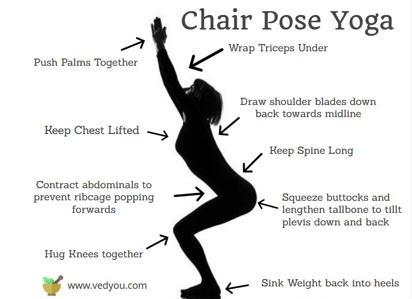

NOTE TO COMS: Measure Twice is an AO. It deserves a category!

Measure Twice had the unfortunate bad luck of officially launching just prior to pandemic-related lock-downs so it had not yet built up a healthy following before everything went by-by. But it's a fantastic location with a clever concept. Since this is (I think) the first Measure Twice BB, here's the concept:

Measure Twice is a 60 minute work out. First half hour: run. Second half hour: stretch.

### Warm-up:

20 merkins.

### The first measurement:

Approximately 3.5 mile loop. Today's edition took us south towards the library, east on Morrisville Parkway, north on the Carpenter Watersheet greenway to President's Walk with a loop around the pond for good measure. Check out Strava for details. The pace was conversational. So much so that the PAX were finishing each others stories and starting new ones before the first ones were ever begun. Had to have been there.

We finished in exactly 30 minutes. BANG!

### The second measurement:

Started with some sun salutation stuff.

Then some leg stretch stuff.

Then some balance stuff.

Then some warrior stuff.

Then some low plank stuff.

Then some sit-on-your-butt-and-stretch stuff.

Then happy baby and have a nice day stuff.

### COT

7\. 2 'spects.

Prayers for Julia and all the kids who would have been transitioning from school to summer but who are not transitioning from bored and lonely to very bored and very lonely.

### NMS

- Welcome to the gloom Valjean!
- Outer Banks can apparently be pronounced "Corrola"
