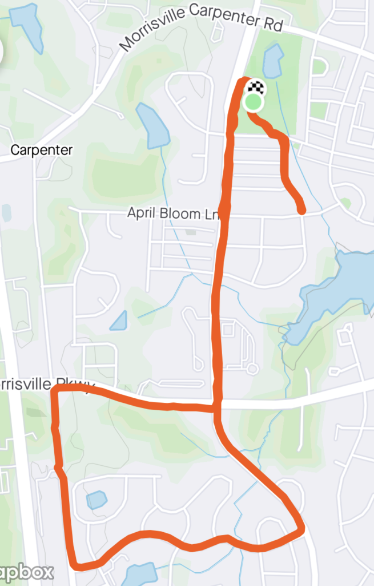

Music has always been a core part of my life. Piano lessons starting at age 6, leading high school youth group on guitar, dancing like a fiend at Phish shows, and most recently mountain biking at Lake Crabtree classic rock (thanks to Road Rash for the tip). I knew once it was time to VQ I'd want to find some way to incorporate it into the gloom, at the very least to honor my namesake.

Apparently I missed a Sunday morning slack from Pivot offering the Measure Twice Q, but Torpedo graciously EH'd me to lead one of our more unique AO's. Immediately phone'd-a-friend, my buddy Sandeep who is a yogi out in California, who sent a wall-of-text instructions for me to decipher. After a late night cram session of Youtube yoga videos and recording a few tracks on piano, felt somewhat ready to go.

### EC Warm-up: The Tail

After a quick jaunt to Apex to grab Valjean, we arrived at Carpenter Park @ 515. Saw Torpedo's vehicle, so convinced him to join a mini EC to draw The Tail. No Torpedo, we're not drawing the comet NEOWISE, but rather making it an eighth note. A quick out & back and greeted with 11 more HIMs ready to rock and roll.

### Thang 1: Measure Once (Run)

Explained the Strava art route -- straight down Louis Stephens, take a right through Heritage Pines, back up Carpenter Upchurch Rd, right on Morrisville Pkwy, and back up to Carpenter Park. Given the 3+ mi route I offered a down & back option to ensure we were back in time for Part II. Some confused faces but off we went.

What I neglected to factor in is most PAX are way faster than YHC. Almost immediately 10/14 sprinted ahead, leaving me in the dust along with a few fellow PAX. Silver lining: great to get to know you, Butterscotch!

### Thang 2: Measure Twice (Yoga)

We followed a "Yin Yoga" routine, designed for runners & walkers with target areas of feet, calves, hip flexors, lower back release, and IT band. Idea is to hold for ~2 min, not engaging muscles but isolating them by calming mind, breathing deep, and letting gravity do the work.

- Mountain Pose
- Butterfly
- Toe Squat
- Firelog (aka Square, or Double Pigeon)
- Lizard
- Sleeping Swan
- Windshield Wipers
- Corpse / Have a Nice Day  
    _(Transitions: Downward dog, cat/cow, child's pose)_

### COT

14 PAX. Prayers for parents, teachers and other leaders who are trying to figure out best educational option for our kids. I also shared and asked for prayers for my mom & dad as she is battling ovarian cancer.

### NMS

- Apparently there is no easy way to turn Voice Memos into a playlist.
- Fun fact: in Unicode, the symbols U+266A (♪) and U+266B (♫) are an eighth note and beamed pair of eighth notes respectively. Also apparently it's a "flag" not a "tail," and the British version is a "quaver" (thanks Blowout!)
- Morning Playlist
    - Run
        - Tweezer, Phish (7-31-13 aka "Tahoe Tweezer")
    - Yoga (recorded by YHC on piano)
        - Improvisational intro
        - Love Will Come, Vince Guaraldi
        - Claire de Lune, Claude Debussy
        - New York State of Mind, Billy Joel
        - Linus and Lucy, Vince Guaraldi
- Took the featured image of the sky and clouds above on my way home -- what a gorgeous sunrise. Claire de Lune was dedicated to my dad, as I know he's facing the toughest struggle in his life right now supporting Mom especially in a pandemic. This is his favorite piece. Every time I would come home from college I'd start playing it and he would immediately walk over and sit down in a nearby rocking chair, eyes closed, at peace. Hang in there too, Dad -- I love you.
