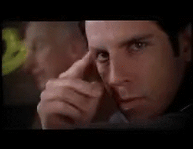
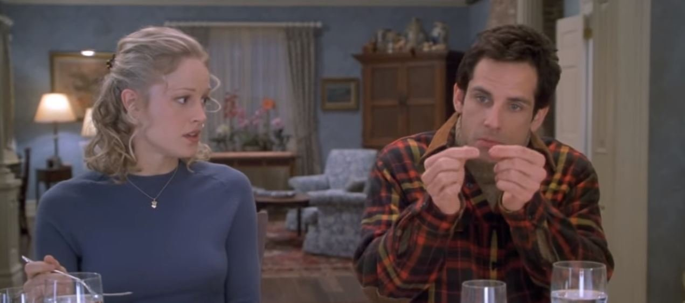
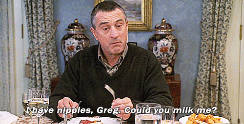

Twas another splendid Tuesday morning in at Field of Dreams. YHC was ready to go after a brisk run to the AO with BOGO, Squatter, and Michelob.

We gathered, I recited some form of a disclaimer. Debate ensued on whether we should state the fact that it is a disclaimer, or if we should simply disclaim.

Quick mosey around the parking lot and we all join the pivot family circle of trust for warmups.

- Gaylord Focker Good Mornings
- 
- Dina's Don Quixote (windmills...check the exicon)
- Jack "Webb" Byrne's
- 
- Pamcakes Plank Jack's
- 
- Add in some lunges as I attempted to propose to Hi-liter...he looked like:
- 

So, after the failed proposal it was off to New York to meet the parents. Unfortunately, the airline lost our luggage. So we did ascending lost luggage lunges at each light post up the hill to the upper lots.

Let's have dinner with the family! Grab a partner for awkward dinner 3-2-1s.

300 awkward prayer squats (one legged prayer squats)

https://youtu.be/IKE1IXvJB9Q

200 nipplers

100 dig-squat-burpees

https://youtu.be/cmcuUGT7FZg

We now found out that Jinx the cat is lost. Unfortunately, Jinx is strictly a house cat, he lacks outdoor survival skills. We form a search party on the field and search the four corners with 1st corner, 1st exercise, 2nd corner 1st and 2nd exercise...:

10 **J**ump squats

10 **I**nch worms

10 **N**olan Ryan's

10 **X** jumps

We never found jinx, but did find a similar cat and decided to paint it's tail to look like jinx. Bad idea...the weekend went horribly and now we are headed home alone, but get pulled off the plane for saying bomb. You can't say bomb on an airplane, even if you are a bombardier and someone asks you about your job

Quick set of B.O.M.B.S with a run around the pickle between each exercise.

We've now earned our way back into the pivot circle of trust. Some Mary was done and then the credits rolled.
