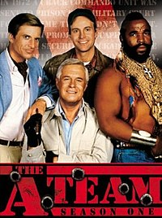

It snuck up on me, but my 6-year anniversary of my first post is 6/15. I first posted at A-Team, at the urging of Hotspot, way back in 2015. You know he can be convincing...

Crazy busy schedule these last few days, with 2.0 Zip Drive wrapping up his high school career, and all the celebrations that signal the end of one phase, and the beginning of another. But I saw that A-Team was Q-less, and, even with all the crazy in my life right now, could NOT pass up a chance to see if I could pull off another themed Q there. Several (many?) years ago I ran through the Exicon with an A-Team themed Q...once or twice I've made the full lake loop on the move...but I've never pulled off the full cast exicon lake loop. I was feeling it today, but we'd need to drop the hammer and keep it down the whole time. Last time I did it, we had like 12 guys. Today? Me plus 28. **Audible 1**. Had to think of some good routes on the fly so it didn't get too repetitive.

Co-site Q @Compound W had already established that we had an FNG (welcome Kevin, now @Wawa...), however I did not properly announce it. **QF1**. No other new faces, so I felt comfortable, and among friends. 2 former NanTans, the SandTan, the StopwatchTan, my F3 Dad, and a whole host of folks were ready for the show. We had 8 Respects and 5 HONORS with us!

**Audible 2** was handing the disclaimer and mission statement off instead of owning it. **QF2**. With Hello Kitty running in from home, I spotted him, and so as not to break his stride, COMPLETELY FORGOT THE PLEDGE OF ALLEGIANCE. **QF3.**

There was chatter just before the start of where the warmup would be. We needed to move, and my choice of powerline hill parking lot was a bit too far it seems. **QF4**.

**Warmup:**

Quick mosey to the powerline parking lot, then circle up for (best as I recall):

- Good morning
- Imperial Walkers
- Merkins
- Daisy Pickers
- Maybe something else in there?

...then we took off down the hill. We got to the bottom, and I attempted to get the gang to spread out in 2 lines facing each other, for the first exercise:

**H**appy Jacks IC (5 SSH, 2 jump squats), repeato x 4 or 5 or something close to 6

Run along the path, by the lake, to the circle for

**A**TMs (alternating shoulder taps, tempo merkins, fast merkins)

Run to the basketball court for a new one

**N**ever Cross Dolly x 6 IC, an iron cross mixed with Hello Dolly

Stay here for the

**N**ever Surrender x 6 each side. **QF5.** Pax suggestion duly noted...never, EVER, do those on hard surface again.

Mosey on over to the bottom of AYG hill for the

**I**nch Worm x 6 or so. **QF6.** It's not even worth repeating.

Run up AYG hill, make a left, then hold at the top of Powerline for

**B**oo Boo Bear Crawl, keeping one leg raised for 6 reps, switching to the other for 6.

Head down the hill for

**A**ustralian Snow Angel x6 IC

Stay here for

**L**BC x 6 IC

Mosey on towards the shelter and let's hit it for some

**F**ingertip Merkins x 6 IC

Mosey to the tennis courts to satisfy @Hi-Liter's desire for the 4-man box merkin, which we did NOT do...but we did

**A**lternating Shoulder Taps x 6 IC

Mosey over to a nice patch of grass, being warned by former NanTan Ma Bell to watch out for fire ants. Found them. **QF7**

**C**hilcutt Jacks x 6 IC

Mosey back to the bottom of AYG hill for some

**E**l Capitans (of course they all wanted to call them Half Domes...). Thought this would appease Hi-Liter. He was not amused.

To the top of the hill, find a patch of grass, get ready for some

**M**akhtar N'Diayes, again finding fire ants and this time, dog poop! **QF8**

Head back down the hill for some

**U**pstraddle hops by the lake. I took a moment to look around...what a bunch of goofs we were, and I think I saw a few smiles. Heard some grumbling about how this was like One-legged burpees, and they didn't like one-legged burpees...

Time to kick it in high gear with another lap through the HEY TURN LEFT ON THAT TRAIL SABAN, and took the pax through woods, and yes, past the pull up bars until we were right back where we started for some

**R**anger Merkins x 6 IC

Headed up Powerline hill for some

**D**ying Cockroaches at the top x 6 IC

Back down AYG hill for some

**O**ne-legged burpees x 6 OYO. **QF9** coming here, as I should've headed back up AYG hill, but instead went back towards the tennis courts for some

**C**opperhead merkins x 6 IC

On the move, with time LITERALLY running out, with a quick stop at the bottom of Powerline hill for some

**K**nerkins (knuckle merkins) x 6 IC, then a quick step to the top of the lot for some

**B**ox cutters x 6 IC, with a car trying to back out over us. Cobains to the driver of said SUV...**QF10**

and the last exercise is

**A**YG to the flag. Yes, to the flag, not to where everyone else is gathering in the "typical" COT lot.

Mileage: about 2.75.

Exercises: 21 in the main event.

And yes, we did hit all our main characters of HANNIBAL, FACE, MURDOCK, and BA. As Big Red said, we had a plan, and Murdock loves it when a plan comes together.

**Countarama:** 28 (plus one feline who departed a tad early) As we got back to the flag _\*with time expired_, I jumped into Count-A-Rama, then Name-A-Rama, and completely missed the Pledge I planned to do, didn't get a proper backstory on our FNG, it was all just a solid mess. QFs **11-15** or so. Luckily had presence of mind to switch on the old iPhone to at least get a semblance of who wuz there.

**Namearama:** see tags

**Announcements:**

- FreedToFeed needs YOUR help! Sign up if you are able, see the appropriate Slack channel. Thank you Bootlegger

**Praises:**

- My M's somethingth birthday today, and 2.1 spending a fishing vacation with his grandfather

**Prayer concerns:**

- Burt's neighbor Roz, who just passed away.
- Continued prayers for McCants and his family situation.
- My own Dad who is suffering from MDS, a form of preleukemia
- Others spoken or unspoken, that I failed to properly honor

**NMS**

- Apologies to our Ruck and Bruiser teams for my miscue at the end of flying by you. I told the Pax to head for the flag, and COMPLETELY forgot the whole "different starting/ending point" nature of A-Team. Which, by the way is just weird to me, (even though we've been doing it that way for, oh, **5 years** or so now?), that this AO starts and finishes in different spots. I'm wondering if maybe the flag needs to be moved to where we actually finish. That really would've helped me today, as since I neglected to START us with the Pledge of Allegiance, I intended to FINISH with the Pledge of Allegiance. And even failed at that.
- Also, for all the upper body stuff that I really had not considered until I saw a glaring NanTan emeritus giving me the "what gives bro" look more than once. Sorry Ma!
- I've gotten to know so many of you so well over the years, and yet, I still HATE letting you down. You deserve better. I'll Get Better. It's been a crazy week. Month. Year.
- There is no better place to fail and learn than at F3. I need to be more flexible in my planning and be cognizant of us all, where we all are. Today was too much moving around without purpose. I will officially retire the character exicon challenge from my personal repertoire.
- Yeah, right.
- You all kept going along with me even though you knew it was a mess. I'm better for it. Hopefully you are too. Even with all the chatter and griping and complete gaffes, this is a safe space for days like this to happen. I told my M what I was planning yesterday and she gave me the "Ooh, mmm, that may not be the best idea..." She's a smart woman.
- I'm pleased as punch to be able to be out in the gloom with you all, every single one of you. I look forward to another chance someday soon to redeem myself somehow.
- And Thank You to my friend Hotspot for introducing you guys and F3 to me, and for continuing to be my friend even when I do stupid stuff like today.
