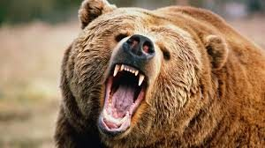

YHC was excited about Gran Torino since it was announced. Not being a hi-tempo kinda guy, posting at this new hi-tempo workout presents a challenge, the kind of challenge YHC seeks. But leading the workout? That's enough to make even a grizzled veteran a little anxious. The PAX are expecting a proper and thorough beatdown, so at 05:30 (by the QIC's watch) we're off.

**Warm-Up** A quick pledge at the flag, and mosey safely across the street to the tennis park parking lot and circle up for side straddle hops, hillbillies, and the Disco Special, 10 burpees OYO.

**The Thang**

Run up to Morrisville Parkway, stopping at each light pole for escalating merkins, starting at five.

Safely cross over to the track behind Carpenter Elementary and partner up for a bear crawl lap, one partner bear crawls the track in one direction, the other partner runs the track in the other direction, flapjack when they meet, continue all the way around the track. A few of the PAX started early so we had to repeat the Disco Special to get their attention.

Head back over to the parking lot with your partner for Catch Me If You Can, one partner does prisoner run while the other partner does five prisoner squats (good ones) then chases him down to flapjack.

Safely cross Morrisville Parkway and run back to the flag, stopping at every other light pole for five merkins.

**Mary**

Circle up for Catalina wine makers, Freddie Mercury, dying cock-a-roaches, and a burpee burnout, as many burpees as possible in our final minute.

**COT**

**Count-a-rama**:  19 **Name-a-rama**:  3 RESPECT, 16 meh, 0 HATE **Prayers / Praises**:  Prayers for One Four's family as his in-laws move in, prayers for YHC's M Kelly waiting for test results, praises for good test results so far. **BOM**:  YHC took us out

**NMS**

YHC's watch keeps the correct time, perfectly and precisely, but it does not measure mileage. Still it's safe to assume we ran somewhere between two miles and Franklin's four plus miles from a couple weeks ago.

As far as I know it was the first time bear crawls were called at this new AO, so we crushed that non-existent record. Your move, Squatter.

The mumble chatter was strong this morning, and didn't let up, from warm-ups all the way through COT. Thought we might have to call more burpees.

YHC usually picks up the six, because YHC usually is the six, but today was planning to ask others to do it. Never got the chance, Carpex is full of HIMs who just do it without being asked.

At least two of the PAX admitted to almost splashing merlot, and YHC was one of them.

We were gonna do those burpees anyway.

Love you guys, thank for letting me lead this morning.
