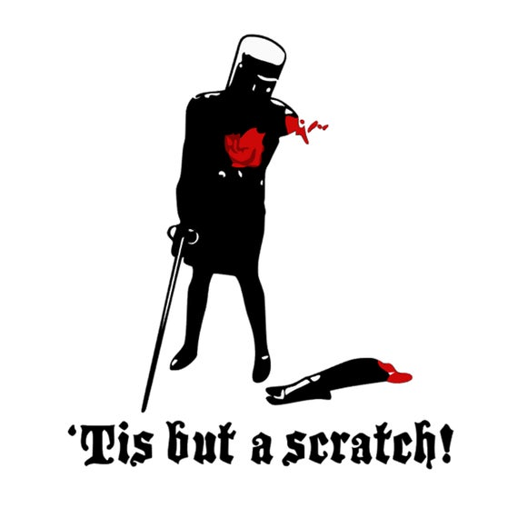

I posted at Danger Zone last week for only the second time to do a little recon as far as what I had to work with for today's 6 month anniversary Q. McCants was a fantastic Q and showed us all, all of the finer areas this AO had to offer. I had a plan, sort of... That plan consisted of a Dora at the pavilion with dips and derkins and other lovely upper body work! That is of course until i had to get stitches in my forearm when the neighbors dog jumped over the fence to attack my dog and i intervened to stop him. The Dr. said no Merkins for a few days, so i needed to make some changes. Here's what went down.

**Warmup**:

2 laps around the pickle (this was the coldest it's been in the 6 months I've been posting after all) and circle up on the basketball court for:

SSH x 15 IC

Good Mornings x something? PAX were not doing a good job of counting

Imperial Walkers x 15 IC

Calf Stretch L/R x Q internal 10 count

Good to go.

**Thang 1:**

Run top the picnic table pavilion and partner up for some Dora action.

100 Jump Lunges, 200 L/R step ups, 300 squats

**Thang 2:**

Mary on a string.

Mosey to the parking lot entrance for LBCs x 20 IC

Mosey down the hill to the corner for Freddy Mercuries x 20 IC

Mosey down Cary Pkwy (on the sidewalk of course) to the Greenway entrance for Dying Cockroaches x 20 IC

Mosey back to the corner for Low Slow Flutters x 20 IC

Mosey back to the entrance for Boxcutters x 20 IC

**Thang 3:**

Mosey back to the basketball court for some suicides back with our partners. Partner 1 runs halfway, back, then all the way to the other end and back while partner 2 does People's Chair with R ankle on L knee. Flip Flop. Repeato.

Mosey back to the flag for some PAX led Mary.

**Mary:**

Pierogi led R/L heel touch x 15 IC.

Saban led Boat Canoe for a bit.

Burt led plank hold with some 6 inch holds thrown in for fun.

YHC have a nice day.

**Announcements**:

F3 Dads this Saturday 9-10 at Bond Park. How How taking over the Flag from Build a Bear. Co-Qing together this week.

Oktoberfest at Koka Booth this Saturday. Lots of Beer and Brats.

**Prayers/Praises:**

Burt's co-worker going through a divorce.

Safe travels for YHC and family headed to Aruba tomorrow.

There's one more I'm forgetting and I apologize.

**NMS**:

YHC celebrated 6 months in the gloom today. TCLAPs to Slappy for EHing me to probably the best thing I have ever done for myself in my life, and I didn't even know I needed! I have pushed myself beyond limits I never thought I could and I have the desire to accomplish even more. While I'm proud of my personal accomplishments, I'm also proud of the way F3 has gotten me to think beyond myself. The men in the COT are the reason I drag myself out of my fartsack in the mornings and work together to make each other better. Better physically, but also better mentally and emotionally. It's all been said before, but thank you to all of you that push me and everyone else to be better every day. Now I'm going to go get drunk and fat in the Caribbean for a week. Can't wait to see how I feel when I get back in the gloom!
