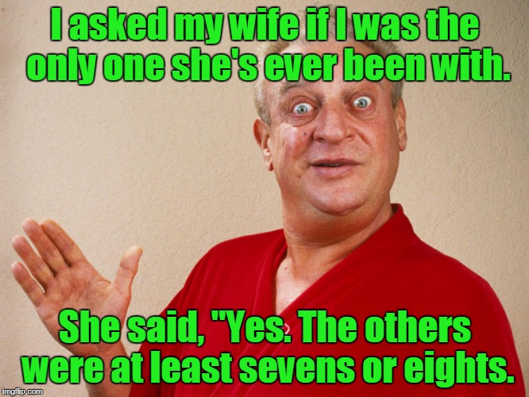

The crowd at Kryptonite this morning is trending to the younger side.  We don't even have Term Paper, although he is apparently identifying as a teenager these days.  Thank goodness Staubach showed up or I might be the oldest guy here. 

A half dozen or so arrive early to run around for the EC while I arrive early to figure out exactly what we are going to be doing this fine morning.  Hermes initially mistakes Imp for Hello Kitty, and Imp starts mumbling something about near-term life changes.  Augmented's hair continues to be stunning.  No FNGs.  Pledge.  Mosey to the huge parking lot and circle up for a warm-up.

- 5 GM IC
- 25 SSH IC
- 15 Imperial Walkers IC
- Calf Stretch
- 15 Merkins OMD
- Calf Stretch
- 15 Merkins OMD
- Runner's Stretch

Mosey approximately 10 yards and line up for the Pain Train.  Merkins x 5, Big Boys x 10, CDDs x 15, LBCs x 20, Jump Squats x 25.   

Once we are done we mosey down the hill and line up for an Indian Run around the lake.  Every time the line cycles through we pause for LSF IC with escalating reps starting at 10.  YHC had no intentions of doing a second lap, but I almost called it anyway once Hermes stated that he refused to do another one.  But alas there are hills to climb.

7's on the office building hill.  Merkins and Prisoner Squats. 

Mosey back to the flag for a Chilcutt minute to finish the morning.  Announcements include Convergence on July 3, TCP Sawgrass this weekend and a new, yet-to-be-named Denali speed workout running in parallel with FMJ starting tomorrow.  YHC took us out.
