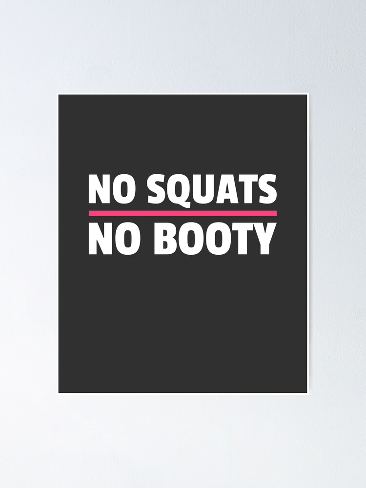

<figure>

<figcaption>

Apparently this is a thing?

</figcaption>

</figure>

When Carpex was set to re-open for business this week, YHC figured he better get on the Q sheet this week. What better AO than Dazed and Confused? Then we realized that the gates remain locked at Apex High School so the decision was made to move to the site of A-Team right down the road. Where YHC Qed on Monday. Hey, at least it was fresh in the mind!  
We had 12 Pax show up for today's beatdown so site Q Honeycomb offered to offload some of the numbers. The Commish immediately started Q shopping on the spot and YHC informed everyone there was a 10K to be run tomorrow morning, so there would be no squats for his part of the workout. When looking for a "No Squats" photo on the Googles, YHC found some interesting pictures for sure. Anyway, here's what we did.

**Warmup:** One FNG courtesy of Hello Kitty, so disclaimer, mission statement and pledge were all covered. Mosey from the front gate to the lot at then top of the hill. 6 Pax decided to follow this Q apparently. They circle up for:  
SSH x 15 IC  
GM x 8 IC  
Sir Fazio Arm Circles Fwd/Rev x 10 IC  
Imperial Walkers x 10 IC  
Plank Jacks x 10 IC  
Calf Stretch L/R x 10 silent count

**Thang 1:** Mosey to the pavilion at the back of the park. Everyone grab a picnic table (which have been turned 90 degrees btw) for:  
Derkins x 10  
Dips x 10 IC  
Irkins x 10  
L/R Step-ups x 20 IC  
Run the pickle  
Repeat 2 more times

**Thang 2:** Mosey to the bottom of the hill. 11's on the hill starting with 1 LBC at the bottom and 10 Freddy Mercuries at the top. Add 1 at the bottom, subtract it at the top until the numbers switch.

**Mary:** Mosey back towards the front of the park to the typical COT parking lot. Circle up for some stretching. (Like YHC said, we have a 10K to run tomorrow)  
Runners Stretch  
Pigeon Stretch  
Butterfly Stretch  
Glute Stretch?  
Pec Stretch  
Press-ups  
Have a Nice Day

**Announcements:** TCP Sawgrass this week. See Hermes on slack for details.  
YHC again is promoting his "Stop Soldier Suicide" fundraiser. Please add me on Facebook and at least share the fundraiser. Thanks to Elementary that shared it and has already produced a donation.

**Prayers/Praises:** Just silent prayers today.

Welcome Sandbox! And Tclaps to Side Out for the suggestion. (He lives right nextdoor to Hello Kitty)

YHC took us out. Thank everyone for the opportunity to Q 3 times this week. MIAGD!
