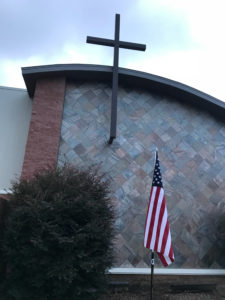

# No Themes - Let's Go To Work

With all of the themed workouts going on lately, YHC wanted to get back to basics.

PAX circled around the flag for a Pledge of Allegiance.  The PAX were then directed to look up at the cross on top of the Sovereign Grace Church.  This vantage point is humbling and serves as a reminder to the price Christ paid for us.  We are truly blessed to be able to do what we do.  The PAX were reminded to not take this ability for granted and in that vein, it was time to take these bodies we are blessed with and Go To Work to make them stronger.

16 PAX with no FNGs.

7 Respects

2 Hates

7 Mehs

Run around the parking lot to loosen up.

Standard warm up exercises.  Nothing fancy.  Just work to make us better

SSH x 20

Good Morning

The Perfect Stretch \* 5 (Demonstration Provided)

Hillbillies x 15

Calf Stretch

Standard Merkin \* 15

Plank Jacks \* 15

**Thang 1**

Mosey down to hill for a set of 11's

1 Burpee at the top of the hill, 10 Sumo Jump Squats at the bottom.  And yes, left right on the Sumo Squats equals 1.

Work in opposite directions until complete.

**Thang 2**

Mosey to the parking lot for Dora.

Partner up and grab one cinder block per team.

Teams completes 100 curls, 200 over head presses, 300 triceps extensions.

Audible called to replace the triceps extensions with rock rows.

Second audible called to modify to Dora 100, 100, 100.

While Partner 1 is doing cinder block work, Partner 2 does Bear Crawl Lines in the parking lot.

**Thang 3**

Mosey over to the picnic benches

Half the PAX doing left right step up leg work

Half the PAX doing their best 5 pull ups

Repeato

**Mary**

Semi circuit near the flag and cross

American Hammers \* 15

Homer to March \* 15

Dying cock roaches \* 15

Orient self to the cross and 1 minute of Have a Nice Day

**Announcements**

CARPEX Anniversary  Convergence - Friday before Labor Day

Labor Day The Carrying Place Labor Day 5 and 10k

Kryptonite converge prior to 5 and 10k

CSAUP this weekend.  See Yogi and Freebird for Clown car details

**Praises**

Final shout out to Brother Yogi for starting Tortouse almost two years ago by himself.  And look at him now.  He just completed his first marathon.  Way to go Yogi!

Spartan took us out.

**NMS**

YHC got a Slack DM asking what Waffle House we were going to in place of the workout.  YHC responded that was the old Crimson.  That Crimson no longer exist.

Red Ryder shared an experience he had yesterday with a co worker where he was able to have a very positive impact on this person.  This embodies the F3 spirit of being a light to those around us.

YHC gave a shout out to Intimidator for his words yesterday at FMJ.  Don't count the minutes, make the minutes count. We all can have a positive influence on those around us with our words and not even know it.

Truly an honor to lead these fine men this morning.

