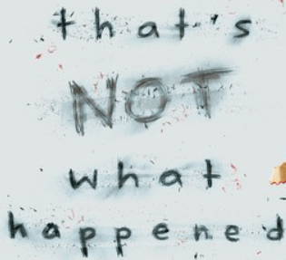

Like most people, for me the thought of a Press On Q ranks up there with having a blind squirrel with arthritis perform dental surgery on you with no anesthesia while the two of you are being chased by a rabid gorilla on stilts named Rex--though why anyone would name a pair of stilts is beyond me.  (Hey, if Press On wanted a lucid BB he should have told Blow Out to write it, not me).

But that is just what faced poor Blow Out as he watched the minutes tick by with only he and Press On standing by the flag at the greatest limited (remember that word) run AO in Carpex on a Tuesday.  As YHC was running slightly hot I missed the opening rock-scissors-paper to see who had to Q because 1) Riptide was never late so he was probably out for some reason, 2) Pickles had gotten into the sauce again and 3) YHC was on the way and would want to Q...because it was just turning into that kind of morning for Blow Out and Press On.

5:45:01(ish), YHC rolled into Claymore to see two men running around the perimeter of a mostly empty parking lot.  I quickly checked the Q sheet to confirm it wasn't a Flacco Q (though there seemed to be a common denominator I couldn't put my finger on).  But I quickly remembered this was Claymore and not that site in South Virginia with the two (wow, it IS hard to say that with a straight face) site Qs.

Warm Up:

Sir Fazios with seal and Liverpool claps

SSHs

Some horrible thing Blow Out likes that was like deconstructed SSHs

Some other stuff

Thang 1: Baseball Bleachers

One PAX runs the pickle but stops at the picnic tables to do 20 of an exercise.  While he's gone the other two PAX do an exercise (i.e., Balls to the Wall, derkins, step ups, etc.) to failure.  Returning runner communicates what he did at the picnic tables and that becomes the new exercise.  Next PAX runs the pickle and does 20 of a different exercise.  2 rounds

(Actually a pretty brilliant off the cuff idea, Press On).

As soon as we started a car pulled into the parking lot and out of it came running my nephew, the recently named, Dom Perignon.

"Frisco, told me never to show up if I'm late because everyone would get burpees," he said.  "But I came anyways!"

YHC searched his memory trying to remember if I had told Dom not to show up late or not to show up IF you're late.  (Wow, two little words and the whole sentence changes...)  But he was there so no harm, no foul.

Thang 2: Rock Pile

Stop at the Rock Pile for some coupon work with ego rocks.

Each PAX leads three exercises then the group runs the pickle.  Next PAX leads three exercises.

Repeato until all PAX have led one set.

Thang 3: Back to the Basket Ball Courts

Press On for some reason loves the Claymore basketball courts.  Whenever YHC asks him about it he always smiles and says no reason, but then immediately asks me if I remember the time WWW had a pick-up basketball game as a workout. Then says "remember how I accidentally elbowed you in the face every time I took a shot since you were guarding me?  No?  That's right you were unconscious by the 5th or 6th point I got.  Good times, good times."

Since it was a limited run AO Press On decided to dial back the running...no wait, that's not what happened...

One PAX runs the perimeter of the court, other PAX in a line.  Other PAX in a single file line do the exercise the first person in line calls while they wait for the runner to return and go to the back of the line.  Front of the line PAX runs and the line moves up.

SSHs, Squats, and some other stuff was done.

Thang 4: Tennis Courts Part Uno

Back to the rock pile for two traveling rocks per PAX.  Head to the tennis courts with rocks held high.

At the tennis courts it was finally time to dial back the running so...no wait...that's not what happened...

One PAX runs the perimeter of the entire tennis court section with his two traveling rocks.  Other PAX stay behind and do an exercise until failure and/or the running PAX returns.  YHC was starting to discern a common pattern in the Thangs.

Dom

Thang 5: Tennis Courts Part Deux

Peoples Chair on the chain link fence, ten count per PAX, rocks held out in front.

Mary:

We returned our rocks to the pile (in their proper place and spaced exactly 5 cm apart since this is Claymore, not that other Tuesday site that tries to increase attendance with <snicker> coffee).  Press On led the PAX back to the flag...no, wait...that's not right...

Press On found the driest spot in the entire park to do Mary which was back to the concrete of the baseball field bleachers.  YHC knew it was the driest spot because Press-On said "Frisco, this is the driest spot in Claymore.  Make sure that goes in the Back Blast.  And in case I haven't mentioned it you are one prime specimen of beercake."  (Hey, like I said Press On should have written his own BB if he wanted a factual account).

We circled up and did PAX choice Mary.  American Hammers, Control Freak Merkins, Boat Canoes and planks with ten counts got called.

Count-a-rama: 1 Respect, 2 Mehs, 1 Hate

Announcements: Burgaw workday coming up.  See Slack for details

Prayers and Praises: YHC asked for prayers for his M as she continues to deal with the grieving process

Our fill in Q took us out and we were done...no, wait...that's not what happened....

After COT as the PAX stood to move on with their day, Press-On informed us that we had not actually escaped penalty burpees for two PAX showing up late.  So we did as many as we felt our blatant disregard for starting time deserved.

And, yes, that did actually happen.
