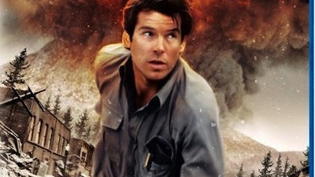

   

11 brave PAX ventured out on Odyssey Eve, looking for some last-minute prep work before the main event.  YHC was feeling competitive and decided to battle it out between two teams through a series of four relays and races.

   

Here is how it went down:

   

**Warm up**

Quick jog through the woods, bear-crawl over Bear-Crawl Bridge

Pit stop at the pond, 10 burpees OYO

Continue to the far parking lot, paint the lines and then circle up

In cadence:

15 Side shuttle hops

10 Imperial Walkers

  7 Good mornings

10 Standard Merkins

10 Mountain Climbers

   

Count-off in 1s and 2s

   

**The Thang** 

_Race 1 -_ Big parking lot

\- line up in team 1 and team 2

\- first person runs to 2nd light pole, 10 merkins, run back and do 5 bropees with next guy in line

    \*Sumo squats and squat jumps while waiting in line, alternating in sets of 20

WINNER - TEAM 1

_Race 2_ \- Still big parking lot

\- line up in team 1 and team 2

\- First person runs to 3rd light pole, 10 merkins, run back and....skip the bropees - audible!

    \*LBCs and Freddie Mercs while waiting in line, alternating in sets of 20

 WINNER - TEAM 1

_Race 3_ \- Down the hill on Evans Rd from the top parking lot (.3 mile stretch)

\- line up in team 1 and team 2

\- all you got to the basketball court - next guy goes once partner is out of site around the bend

  \*Merkins and American Hammers while waiting in line, alternating in sets of 20

 WINNER - IT'S A TIE

_Race 4 -_ Basketball court

\- line up in team 1 and team 2

\- 1st man from each team suicide run, rest of the team is alternating balls to the wall and people's chair as each team member goes

  Second team member then goes, and so on until winner

 WINNER - TEAM 2

   

_Indian Run back to the flag in teams -_ Freebird suggests we go the long way, which sounds like a good idea to YHC - we complete the .5 mile loop around the fields

   

**Mary**

Overall winning team gets to call Mary - Team 1

In cadence:

Homer to Marge with 1 leg extended

Boat canoe

Shakira

Box cutter

Chill cut plank

10 Burpees OYO

   

**COT**

11 PAX

_Announcements:_

\- Odyssey tomorrow, 5:45 arrival

\- Triple down in Raleigh next Saturday

\- Christmas Party at Bond Brothers Dec 14th

_Prayers/praises: -_ Edward, Odyssey

_BOM:_ YHC took us out

   

Fellas, thoroughly enjoyed it this morning, thanks for letting me try out the relay ideas - I look forward to seeing everyone tomorrow!
