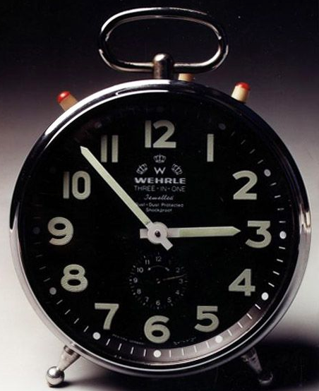

One year ago I showed up to Apex Nature Park on a Monday and asked some guy named Disco Duck if this was the "workout group." A couple of days later I'm running laps next to a dude with a monkey taped to his crotch. To try and sum up even just one year of highlights and memories would be a muggo sized feat. The current task at hand is to provide a worthy beatdown to the 32 PAX that chose to grace FOD on a beautiful Tuesday morning.

**Warm Up** - Good mornings, SSH, Burpees, Sir Fazio, Seal Claps

**Thang 1** - Break into 4 Groups for different arm burners - 2 rotations of the following

- Group 1 - Merkin ascend/descend the baseball staircase
- Group 2 - Dips in the Picnic Shelter
- Group 3 - I-Beam pull-ups
- Group 4 runs the pickle and rotates the stations

**Thang 2** - Basketball court suicides, stopping for 5 merkins each line followed by repeato, this time with get ups. Too much time left so BTTW while PAX went down the line on a 5 count... Still too much time, Indian run the pickle.

**Mary** - Dying Cockroaches, Boat/Canoe, Burpees, 170's....nope... 100's, 60's... nope... 70's, American Hammers

32 PAX today, very problematic!

**Announcements**

PACKHope Experience - See Slack for Details

**Prayers/Praises**

- Beakers cousin Adam - prayers for his family with his passing
- Ma Bell's employee - safe and healthy delivery

**NMS**

- Liverpool's MC game is strong, at one point I tried and failed to overpower it
- Demonstration please for Star Plank Side Crunch :)
- One day I'll be able to count 100's successfully
