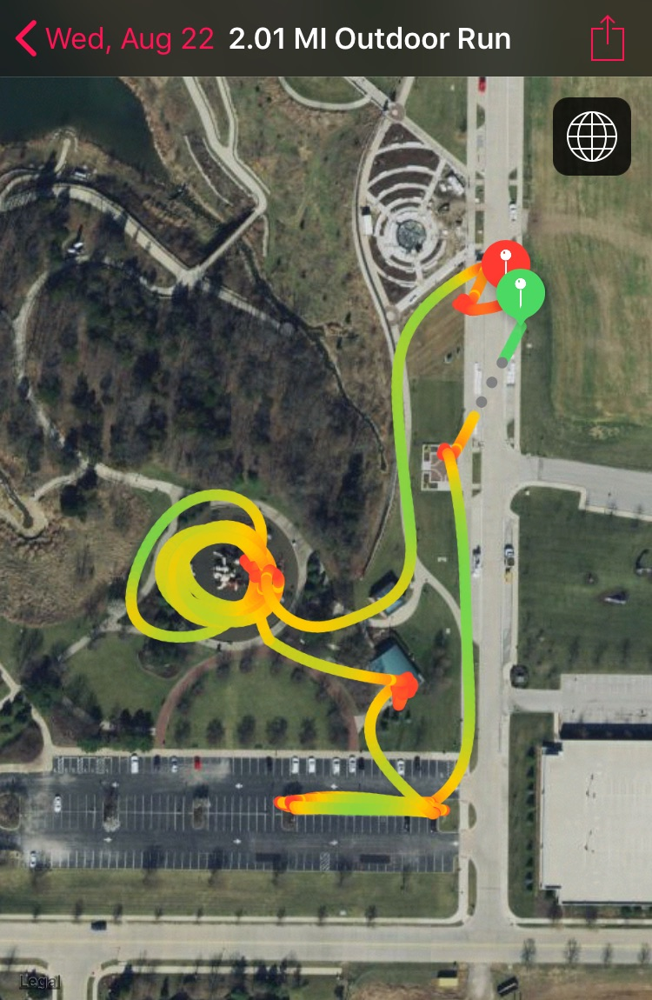

Warm Up - Run to the first Parking Lot for SSH, GM, and IW.

Two groups for Indian Run to first Hill.  All you got up the hill complete the below exercise and jog back.  Run to the next hill and repeat.

- Hill 1: 20 merkins, 10 squat jumps
- Hill 2: 20 CDD, 10 jump lunges
- Hill 3: 20 diamond merkins, 10 broad jumps
- Hill 4: 20 wide grip merkins, 10 donkey kicks
- Hill 5: 10 blast off merkins, 20 monkey humpers
- Hill 6: 20 Nolan Ryans, 10 J Los
- Bridge 1: bearcrawl, lunge walk

Group Indian run to the parking lot with a couple extra cool down laps to complete 4 miles per Old Maids encouragement.  Sir Fazios Arm Circles to take us out because Grease enjoys them (he didn't do them).

COT - 9

Out route looked like a sun which reminded me of what my pastor and the song below say: Get over the Sun! King Solomon had it all and searched for satisfaction under the sun but it could not be found.  We need something bigger and better which can only be found in Christ Jesus.

"Sitting around the fireplace With a friend who's been through it all Solomon, wisest one, tell me what you have found Under the sun, under the sun He answered, "Get over Get over, get over the sun Get over, get over, get over the sun Where life is hidden" And then he put on a somber face Talked about how the rich man will waste Away in the ground where the poor man is found Painted up like a clown under the sun, under the sun He answered, "Get over Get over, get over the sun Get over, get over, get over the sun" Soon you'll be done A life spent on some shiny God Who leaves you empty Get over, get over, get over the sun Get over, get over, get over the sun"

 

https://www.youtube.com/watch?v=bE3hrhr0\_90
