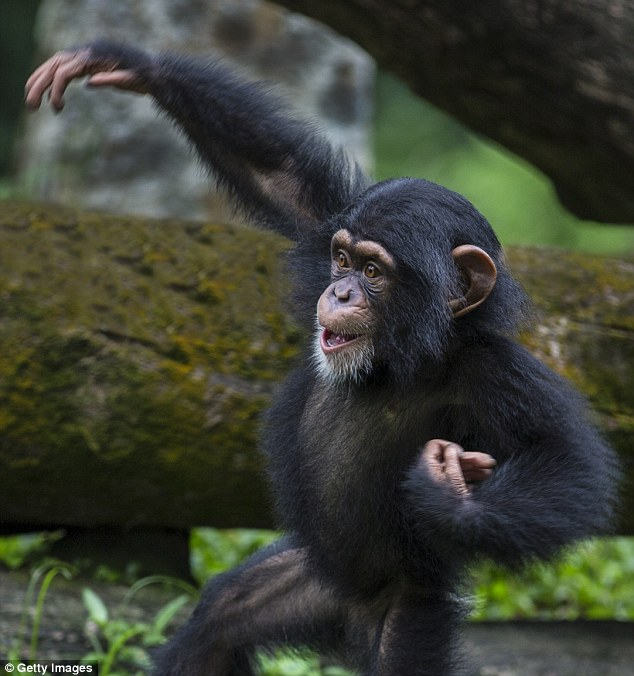

Nine (+ 2 Ruckers) PAX made it out to Kryptonite for a Monday morning Q to begin prep for BRR 2021. Oofta screeched into the parking lot at the bell, and at 530 AM, we kicked off on-time with the Pledge, and off we went.

### Warm up

Half-mile jog around the amphitheater to the Symphony Lake Bridge with expected heckling from Burt and Flip (Fleep) Flop.

- Good Morning
- Calf stretches

### First >> Nine's at ABB parking lot/hill

Finish trail and head across the street to ABB parking lot. En route, Grease Monkey took a necessary pit stop in the woods (hence the photo above) and Burt coined "Pick Up the Sh\*ts" fellas.

- Bottom of Hill - \*Star Jumps, Top of Hill - Squats according to the Nines.
    - \*Note - Star Jumps did not result in a second-round woods visit for Grease Monkey.

### Second >> Rock Pile + DORA

Grab a partner, grab a rock, run to the third lit street light, and hit the following exercises in between:

- 150 E2K (Elbow to Knee - 75 on each side)
- 100 Arm Curls
- 100 Overhead Press

### Third >> Home to MARY

Mozy back to the parking lot and close out with PAX-led MARY:

- Homer to Marge
- American Hammers
- Box-cutters
- WW2's
- etc...

### COT

Greenway Pop-up Story Walk ([https://www.greenwaymom.com/popup-storywalk-apex-cary](https://www.greenwaymom.com/popup-storywalk-apex-cary)), Swim/Bike/Ruck, and Prayers for Silas (GreaseMonkey's son) and Liam (the little guy who has heart surgery coming up). Thank you fellas for the opportunity to lead. My BB is actually on time.
