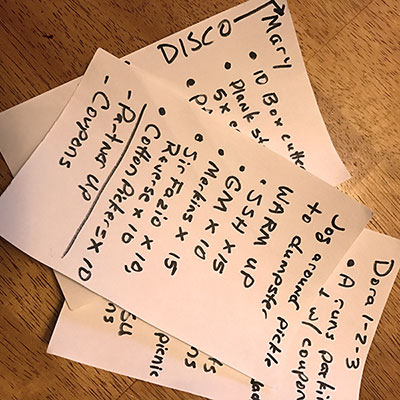

It's hard to write the backblast for my VQ without getting somewhat reflective and sentimental, but I'll save that for the NMS at the bottom of the post. First, here's what went down in the Peak City gloom this morning at Tortoises.

Earhart and Freebird came cruising in from their usual EC run. Various mumble chatter until go time. No FNG's, so off we go on a little jog around the front **pickle** (see what I did there?), then mosey to the back of the main lot for some warm-up:

### Warm-up

- 15 SSH..., nope... wait a minute. Here's 3 Dub rolling in a bit late, so we'll start out with 5 penalty burpees OYO. I know 5 isn't much of a penalty, but YHC wanted to pace himself for his first Q. You got off easy, 3 Dub!
- SSH x 15 IC
- Good Morning x 10 IC
- Standard Merkins x 15 IC
- Sir Fazio (Pet Sounds-style with thumbs extended) x 10 each direction IC
- Cotton Pickers x 10 IC

Pair up and grab one (yes, just one, gentelmen) concrete core from behind the dumpster for...

### Thang 1

- Dora 1-2-3
- Partner A jogs the pickle (there's that word again) while partner B starts on:
- 100 Plank jacks
- 200 LBC
- 300 Squats

YHC was odd-man-out, so I jogged and did AMRAP of the 1-2-3 until we were done, trying to keep up a conversation with Banjo about shirt designs and such.

### Thang 2

Line up in two groups for Billy Run to other end of parking lot (since Billy was there, was it just a run? Or was it a Billy Billy Run? We may never know.) Mosey over to picnic tables for a little bench work: 2 rounds of:

- Alternating Left-Right Step Ups x 10 IC (Well, sort of IC. YHC temporarily forgot how to count for the first 3-4. Thanks for getting the train back on track, guys.)
- Erkins x 10 IC
- Dips x 10 IC

Jog back to parking lot and hand it over to our guest DJ, Disco Duck for a planned change of pace. Sevens to the middle of the parking lot:

- Bear crawl to one end for knee-slap burpees
- Lunge walk back to start for double merkin burpees

Running short on time, we didn't quite get through all 7 rounds, but no one complained.

### Mary

- Box Cutters x 10 IC
- Plank calf stretch x 10 IC each leg
- Passed it off to other PAX for them to call 10x of their favorites: American Hammers, Homer-to-Marge, 6-inch leg lifts, Freddy Mercury, SSH, Windshield Wipers. There may have been others, but YHC can't recall at this time. PAX, please let me know what I missed.

### COT

- Name-o-rama - 13 PAX present and accounted for.
- Announcements
    - Backpack Buddies items due Thursday, August 3. Deliver items Term Paper, Disco Duck or site Q. [More information.](https://f3carpex.com/2017/07/20/backpack-buddies-carpex-community-outreach/)
    - F3 Dads Event - Saturday, August 26. Bond Park. 0900.
    - Give2give campaign for F3 Nation is ongoing. Donations help support expansion into new regions this fall and next spring. Currently looking at starting up in Memphis, Chicago and Austin. Open up your hearts and pockets to keep F3 going strong!
    - FIA - Females In Action. There have been 9 ladies the last couple of weeks at FIA. Soft launch is this Saturday at Bond Park. Official launch date set for August 12. See Earhart for more info.
- Prayers
    - Texas Ranger's M and 2.0, currently in Honduras for a mission trip. Safe travels and return.
    - Healing for Leprachaun's 12 year-old cousin, Edward who is starting his second round of chemo for Hodgkin's Lymphoma.
- YHC took us out.

### NMS

- Looking back at my first post (SNS, Riptide Q, 05April), where I was doing all I could not to spill Merlot, and wondering what the heck I had gotten myself into; I would have never thought that I could actually lead any of these men. Thanks to all of you in Carpex who have encouraged, cajoled and headlocked me along this far. Keep it up; we're not done yet!
- Beginning F3, I expected I would improve in fitness (first F), but the pleasant surprises have been the friends that I've made (second F) and how much I've benefited from Refinery on Wednesday, studying God's word with other PAX (third F).
- Another pleasant surprise has been the joy I've taken in sharing this journey with my 2.0, Leprachaun. I thought I'd _make_ him go once and that would be it, but now he's asking how he might be able to do F3 before school once it starts again. I've seen such a positive impact in him by being around all the HIM in F3 Carpex.
- I only needed my security blanket Weinke once, so there's that. :)
    
    \[caption id="attachment\_382146" align="alignnone" width="400"\] Security blanket.\[/caption\]
- In retrospect, I'm glad the initial proposal for my F3 name didn't stick. It's hard to get much mileage out of _Scuppernog._
- T-claps to Disco Duck for encouraging me to sign up for my first Q and helping out with it this morning.
- Also thanks to Sooey and Crimson for forgoing their normal SNS routine to come out to Tortoises and support me for my VQ.

YHC, Pickles
