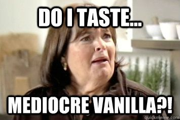

This is YHC's second Q in the POGL this week as we try to class this place up a bit.  This may be the first morning of the year that I would legitimately label as moist.  3 attack the Dino early followed by 11 more boot campers.  Nice to see a few new faces in the crowd that YHC has never worked out with before.

Pledge and then a run through downtown to the church parking lot where we circle up.      

- 7 GM IC
- 25 SSH IC
- 15 IW IC
- 15 Merkins OMD
- Calf Stretch
- 15 Merkins OMD
- Calf Stretch
- 15 Merkins OMD

Mosey to the parking lot at the bottom of Holleman Street.  This is one of the more underrated hills in CarPex.  Plain Vanilla 7s on the hill with Burpees and World's Worst Merkins.

15 LSF IC and 15 WW2 OMU to catch our breath.

Jog back to the flag and circle up in the skate park for 4/3/2/1 Ring of Fire Merkins.  A minute of Chilcutt to finish the day.

Freed to Bleed this weekend.  

YHC took us out.

NMS:  An interesting discussion as we leave about the absence of graffiti in the skate park.  Is it really a skate park if there is no graffiti?   Is it due to the presence of the surveillance state or to the lack of sufficient angst amongst the POGL youth?  Questions to ponder as you move through your day.
