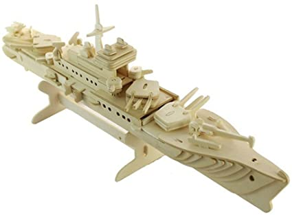

10 HIMs gathered for another Thursday workout at Hot For TaeKwonDo or Hot for Tate or Hot for Teacher (who knows the name anymore). After a stellar pre-blast from Qwerty about Principal Rooney, nostalgic movies, law enforcement, and trespassing, I knew it was going to be a great morning. YHC did some recon earlier in the week and had plenty of options for the beatdown. After realizing there were no FNGs, the F3 mission was recited as well as the pledge. We also discussed safety since some roads would be crossed. Off we go...

## Warm Up

Mosey across Olive Chapel Rd and over the bridge to the office park parking lot. With the gorgeous morning moon above us, Charmin was asked to give us some lunar eclipse facts (which I already forget).

Good Mornings x5 IC

Hillbillys x10 IC

Moroccan Night Clubs x10 IC

To the wall for Wall Sits with: Sir Fazio Arm Circles x10 IC, Reverse x10 IC, Seal Claps x10 IC, Overhead Claps x10 IC, Recover

Back to the circle for a Plank Hold

Calf Stretch then Runner's Stretch

Plank Destroyers x5 (8 count)

Mosey around the parking lot by SpeedPro (for all of your graphic needs, they are the best!) then through the bushes to the next office park location.

## Thang 1

YHC's early week scouting mission was immediately foiled by a surprise, secret Camp Gladiator gathering. An audible was immediately called and found a different location in the parking lot.

Partner Up for Ab Dora

50 WW2s, 100 Freddy Mercs, 150 Homer/Marge, partner runs the pickle circle thing

Plank hold for the Six, stay in Plank position for more Plank Destroyers x5 IC (8 count)

## Thang 2

Time for more audibles (this new Olive Chapel Office Park is fantastic, lots to do!).

Found a wall for Irkins OMD x20

Back to the parking lot where everyone grabbed a small rock. Back with partners, circle up for Pivot American Hammers (essentially moving the rock from side to side as you twist). Partner runs the stairs loop (through glass doors) five times. Flip Flop.

More Plank Destroyers x5 IC (8 count)

Irkins on the metal railings. Then tried to do Australian pull ups on the railings (not very successful).

Time is running out and begin to head back. Stop in front of Olive Chapel ES (on the sidewalk, not on campus) for Monkey Humpers IC x10.

Run the long way around the park lot back to the flag. Realizing we need some more distance, we pass the flag and run behind Publix and back. We were all satisfied.

## Mary

LBCs x10 IC

Pamela Andersons x10 OMU

Plank Destroyers x5 IC (8 count)

Announcements: Chain Gang 11/20 @ 11am, WWCM support at Lowes 11/21 @ 4pm (Sooey needs help), and Hot for TaeKwonDo/Tate/Teacher is closed on Thursday...post at BO for the Thanksgiving beatdown

Prayers: Communication with our Ms, unspoken prayers

## NMS

\-I'm trying to Q once a month and have really enjoyed it. November box checked.

\-HFT is the closest AO to my house (at least until Apex El Cap opened) and have been posting there more often recently. Its been a lot of fun and love the new location.

\-I really do wish I remembered the lunar eclipse facts that Charmin shared, it was a gorgeous morning.

\-Great mumble chatter around if Moroccan Night Clubs were really done in Morocco. Then we talked Hummus and his restaurant for a while. We miss that guy!

\-Almost tried a runners stretch into low-slow Monkey Humpers, but figured someone would get injured.

\-Camp Gladiator's presence really threw me off. I was excited about the location and what was planned. Oh well.

\-Qwerty rode the elevator on the stair climbs. I sure hope there weren't security cameras! And if there were, it was Camp Gladiator trespassing.

\-Coffeteria was a blast and included: Two Factor calling Plank Destroyers "World's Worst Macarenas," watching F45 athletes eating giant breakfast sandwiches from a food truck, and a deep discussion about the Two Generals' Problem & the Dining Philosophers' Table Problem (go ahead and Google both).

\-F3 continues to push me both physically and spiritually. Thanks to everyone who continues to support me.
