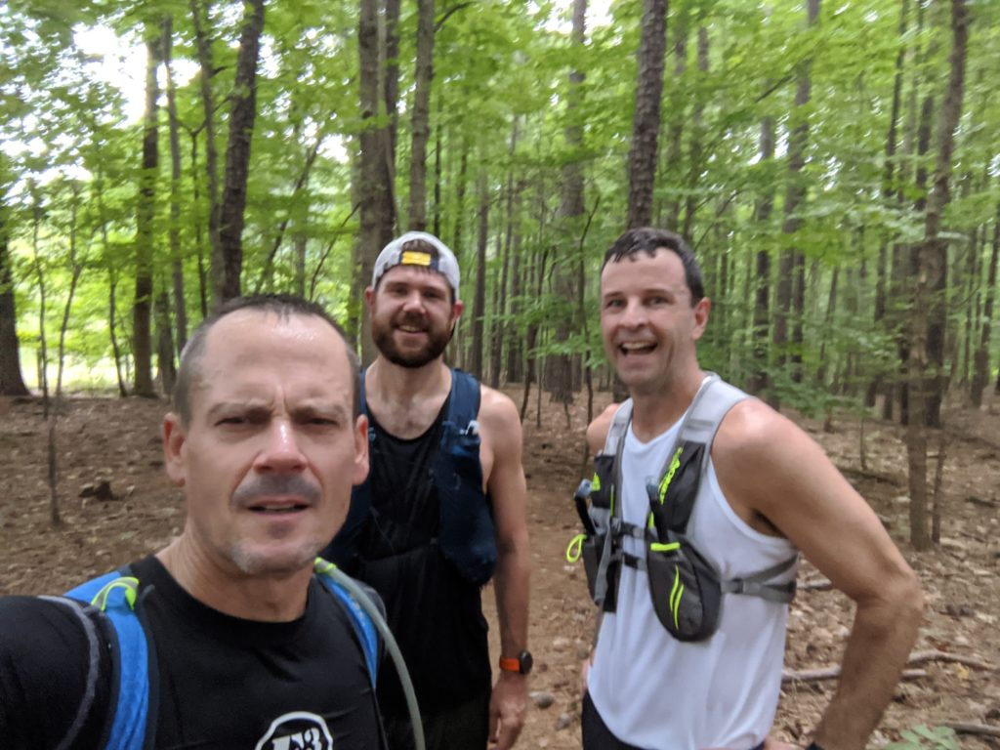
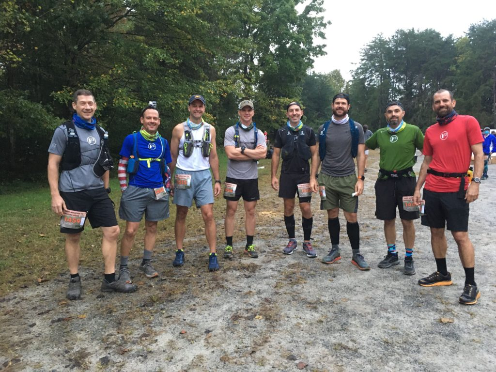
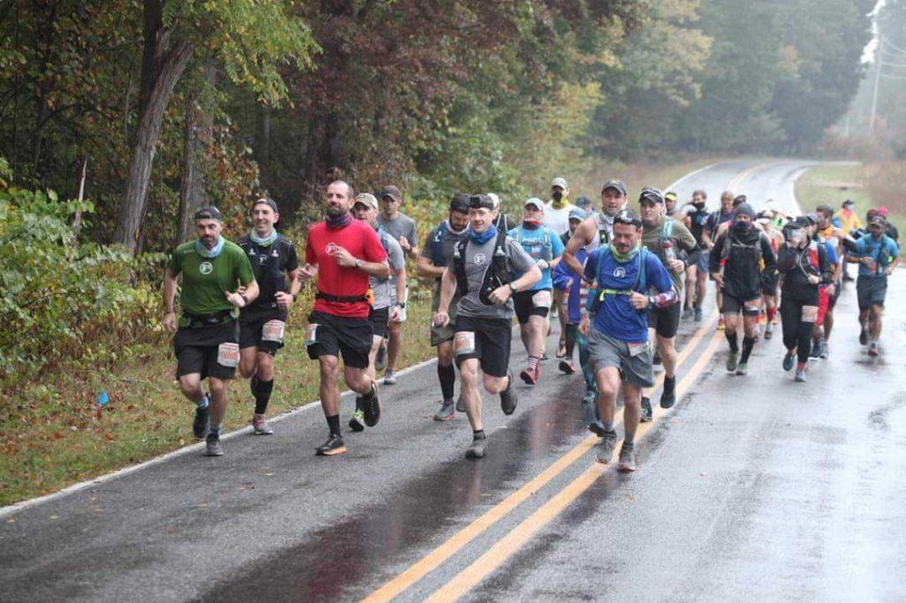
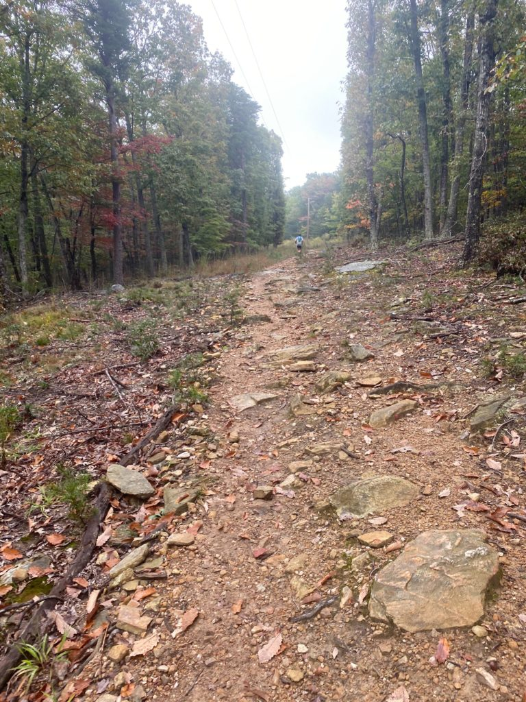
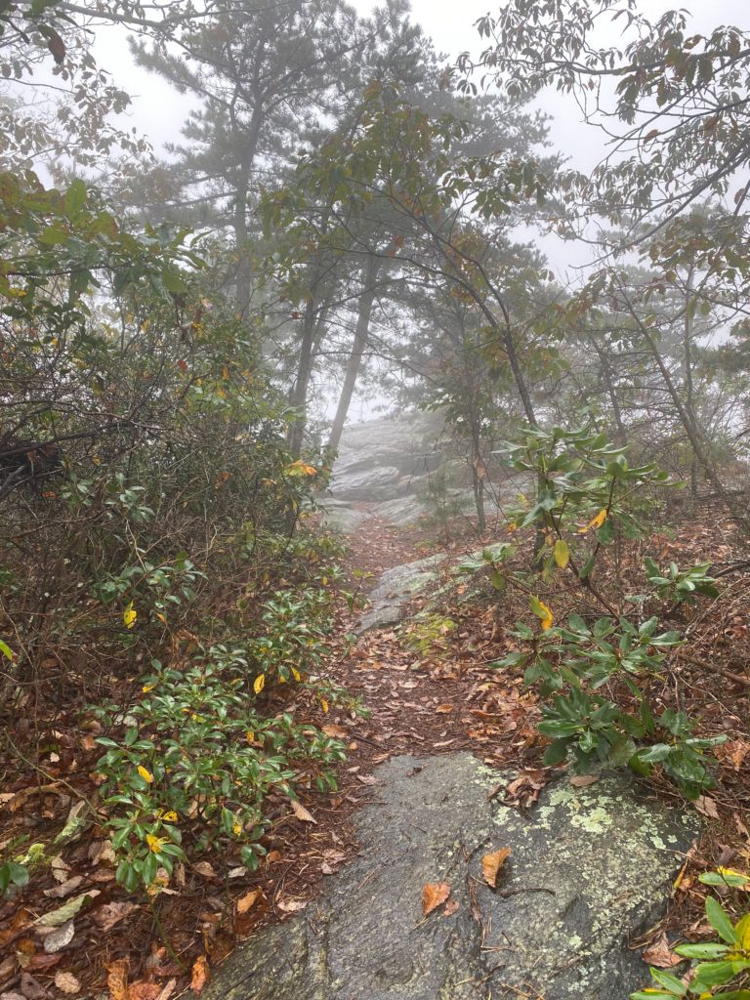
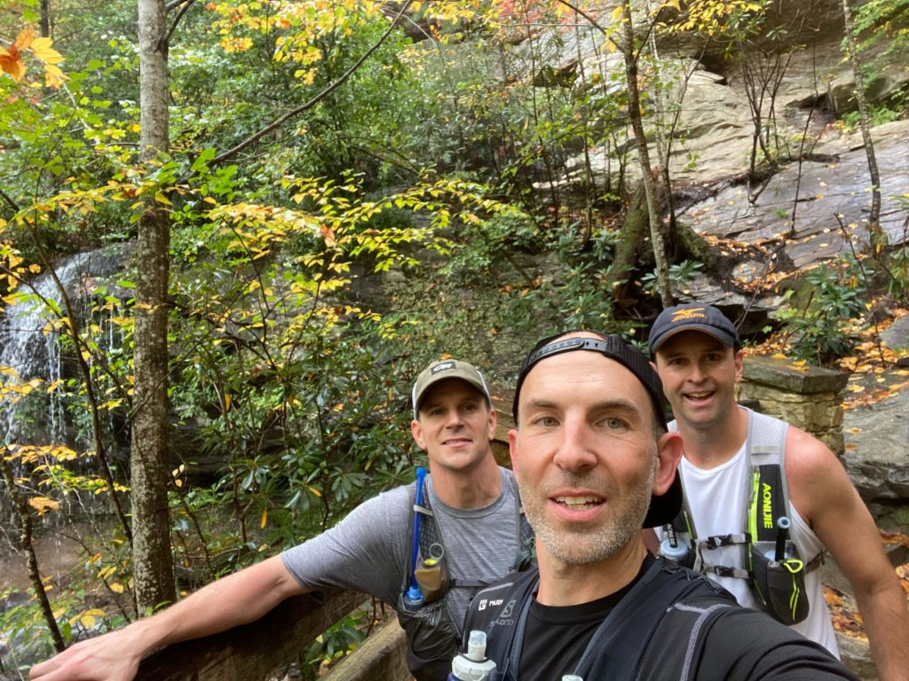
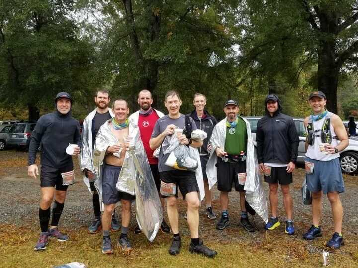

**The Origin Story**:

My DES starts in church, back when we had something known as church.  As is often the case when my wife can't make it to a service, I take a seat next to Banjo.  This is the conversation:

_Banjo_: Man, I just signed up for a race that you need to do with me.

_Lookout_:  Tell me more.

_Banjo_:  It is a 50K trail race from Pilot Mountain to Hanging Rock.

_Lookout_:  I've never run 50K.

_Banjo_:  Awesome!

_Lookout_:  I've also never run on a trail before.

_Banjo_:  Dude, this is the perfect race for you!

I tell Banjo I will check with my wife on schedules, assuming she will bring some sanity into the conversation.  But to my surprise she says yes.  Many months later I discover that she thought she was saying yes to BRR.  Sometimes poor communication skills can get you in trouble.

**The Training:**

13 weeks.  A bit less than 500 miles.  Sounds doable.  My initial plan is just to get through BRR and somehow figure the whole 50K thing out after that, but then Build-A-Bear finds out I am running the race and disabuses me of that strategy.  An hour later I have a training schedule.  Here are some of the highlights:

**_First Trail Run_** - 16 educational miles with Build-A-Bear, Banjo and Headroom.  This is the first time I have ever really interacted with Headroom, and I figure out pretty quickly he is down for the cause.  I get the feeling that if I tell him we are planning a 100 mile training run he will just ask what time to show up.  With this being my virgin trail experience, I have a few things to figure out.  Like how do you run on a trail.  I have seen people run past me while hiking before, but I always assumed they were lost or just really scared of bears.  I quickly figure out that the answer to how you run on a trail is ... very carefully.  About five minutes in I ask if I will inevitably face plant and / or break both of my ankles.  Everyone says yes in unison.  I also have to figure out the trail gear, as I don't actually own any.  Build-A-Bear is kind enough to provide me a loaner pack, but I am forced to cruise through the woods in my trusty Brooks Adrenaline street shoes.  Not recommended.

**_First Solo Trail Run_** - 18 solitary miles.  Even though I luckily have proper trail shoes by now, I spend a lot of time contemplating what I would really do if I break an ankle in the middle of the forest.  Or pass out.  Or get attacked by a wild animal.  Good times to be alone with your thoughts.  But it is also a glorious Sunday morning in a serene and beautiful setting, and it is absolutely impossible to do that run and not have some sort of spiritual experience.  

**_The Banjo Death March_** - 20 horrifying miles with Banjo and Headroom.  It is before dawn when we launch, but that doesn't stop it from being 82 degrees and 1,000 percent humidity.  Banjo says he wants to explore some new trails, which is code for "we're going to get lost and just bushwhack through uncharted forest for a while."  I have calculated water supply based on how long I think we will be out, and this slower pace has completely blown up that math.  Did I mention the humidity?  I run out of water around mile 16, and then the wheels completely come off.  As I walk the last few miles back to the car I try to remember the last time I had to walk to the finish and wonder whether or not I am really cut out for this process.  But I learn a very important lesson about carrying more than you need on the trail.  And about exploring with Banjo.

_Happier times ... before the water runs out._

**_The Double Maynard_** - Ever since I heard about this thing I knew it was so ridiculous that I would certainly have to do it eventually.  The shield lock crew makes this one a fun experience.  Lap one pacing is flawlessly executed by Captain Jack as he keeps it at a perfect and steady opening pace.  For lap two Bagels takes over, and we immediately abandon any hope of calm and steady.  This isn't helped when Staubach jumps in with 6 miles left and decides that we are racing.  But as the three of us pull back into Bond Park way ahead of planned pace I feel like I have more in the tank and that this whole thing is going to work.   

**_The Night Run_** - 24 miles and the longest run of the training set.  This is really just notable because I start running at 3:18 in the morning.  It's a weird feeling to run through the streets of Cary prior to 0400.  Probably not something I am doing again.  And I also get fairly lost in the absolute darkness of the Hemlock Bluffs Nature Preserve trail system.  Not doing that again either.  I don't start quite early enough to make COT at Slippery When Wet as planned, but I appreciate the fact that Oofta, Staubach and Chops hang around to confirm that I am still alive.

**The Race**:

The remnants of Hurricane Delta make the course muddy and slick and promise to bring more rain throughout the day.  Beautiful temperature in the 60's, but humidity is high.  Here are some things I remember.  All mileage references are approximate.

**_The Starting Line_** - This is a general cluster as the shuttle buses don't show up and everyone is routed from the finish line to the starting line a couple of hours before the race.  Rather than run back to our cars we are just going to run and worry about how to get home later. Despite that fact, it looks like a pretty good crowd has found the spot.  The race director takes everyone's temperature with a trick thermometer that never seems to register anything over 98 degrees.  Biner and Blowout make an appearance as they wait for Perogi on the 50 mile relay course.  As usual, Banjo knows 85% of the race participants by name.  Team Carpex (_in photo below:_ Build-A-Bear, Banjo, YHC, GTL's friend Brian who has the audacity to show up without a nickname, GTL, Headroom, Michelob and Largemouth) enters the corral for wave three.  It has been a long road and it's finally time to go.

_We are finally here._

**_Miles 0-2_** - Michelob leads Team Carpex through some nice open trails to start the race.  I start to work through the initial adrenaline rush.  I tell myself a few times that 31 miles really isn't that far. It feels good but a bit surreal to finally have this thing underway.

_We are at least a hundred yards into the race and everything seems to be going well._

**_Mile 5_** - We are in the single digits and life still seems fantastic. Largemouth answers his cell phone to handle a work call.  He is actively conducting business during a 50K.  I don't think I could pull that off, but that's why I'm not an elite runner.

_Largemouth takes a break from business to snap a selfie of the group._

**_Miles 9-11_** - Muddy single track trails.  95% of my (admittedly limited) trail running knowledge has come through shutting my mouth and following Build-A-Bear and Banjo through the woods.  I take this opportunity to tuck in behind Michelob and study how the Wizard handles foot placement.  The Beige Bro team socks are surprisingly soothing when you stare at them for a long time.

**_Mile 15_** - While the rest of Team Carpex slows down to deal with a climb on a road segment, Largemouth and Michelob take off.  It happens so fast that I'm not sure whether they ran away from us or darted into the woods.  

**_Mile 18_** - Calf cramps start to appear in both legs. My hydration plan apparently isn't optimal. Good thing there is only a half marathon left to go.

_The final approach to the aid station at Mile 19.5. They have salt pills, which will prove to be very important._

**_Miles 20-22_** - I lose contact with GTL and the Man with No Name due to the cramps.  Progress slows down to run / stretch / walk as I wait for the salt pills to kick in.  During this stretch I am alone in the woods for the first time in the race.  Despite the circumstances it is incredibly peaceful.  Just silence and a perfect light rain. Also during this stretch I slip on a wet rock and face plant within six inches of a fresh pile of horse manure.  Had my landing been slightly different I would have taken DO EPIC SH\*T to a level that no one had ever envisioned, and we might have needed to simply end the program.

**_Mile 22_** - The cramps subside, and I I catch back up to GTL and TMWNN.  My solo time was nice, but I need people now.  And like it or not these guys aren't going to shake me.  We spend the next nine miles pulling each other through intermittent episodes of cramping and exhaustion.

**_Miles 25-26_** - What in the actual hell is this vertical ascent and who put it this deep into the course?

_The climb up hanging rock ... once the terrain has started to level off._

**_Mile 27_** - The blessed sound of cowbell signals the final aid station of the race.  I am provided warm Coca-Cola Classic, and it is the greatest thing I have ever tasted.  I inform the lady at the aid station that this is the first time in a decade that I have had Coke without bourbon in it.  She seems amused. Or worried. Whatever. Four miles to go.

**_Mile 28_** - Quick team photo at the waterfall overlook.

_Looking better than I feel._

**_Miles 28-29_** - What in the actual hell is this vertical descent and can I just rappel down instead? I have been working under the false impression that the end of this race would be easier since we are moving downhill.

**_Mile 30_** - Banjo catches up to our crew for the finish, which seems appropriate since he got me into this to begin with.  I somehow have the presence of mind to reflect on the fact that I have put in over 500 miles to get myself to this last mile.  There are a lot of emotions including joy, pride and amazement.  And part of me is sad that this particular journey is ending.  But that is a small part, as the majority of me wants to stop running very soon.

**_The Finish_** – The rain is really coming down now.  GTL and I run across the finish stripe together, and the feeling is glorious.

_A lot of very tired people. And Michelob who could have probably just run the course again._

**The Takeaways**:

Maybe “Takeaways” should be translated to “why I’m glad I did this thing.”  The main point was forcing myself out of my comfort zones.  And for me that had physical, mental and social aspects.  The physical is pretty obvious.  Trail running is a completely different beast than what I am used to, and running a long way on a trail course took me places physically that I hadn’t been before.  Along with the physical aspects of trail running, there is also the challenge of staying mentally focused enough to stay upright on ever-changing terrain.  Another mental challenge is embracing something that you know you may not be particularly good at and trying to make a solid effort at it anyway.  But for me the most important aspect of DES was pushing myself socially.  For all of the great things about F3, it tends to focus most of us into the same workout locations (and therefore the same workout partners).  When you start a workout before dawn, the path of least resistance is always going to be finding the AO nearest to your house and maximizing sleep.  Getting out on the trail gave me more exposure and insight into guys I should have made more effort to know in the first place.  Headroom went from a guy I had met a couple of times to a great training partner.  GTL went from a guy I had worked out with a few times to someone I ran a truly unforgettable race with.  Build-A-Bear went from a slightly intimidating guy to someone who just wanted me to get better and was going to make sure I knew how to do it.  Every day we run across someone who has something great to teach us, whether that is in F3 or elsewhere.  Here’s hoping I can leverage this experience to learn more of those lessons in the future.
