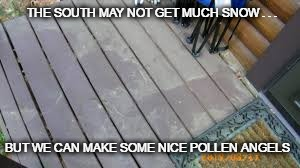

60 degrees and glorious at the pristine new home of the Cougars.  The pollen is THICC.  But 8 brave souls don't care about allergies.    

No FNGs.  Pledge.  Mosey across campus and circle up on the roof top parking deck.       

- 15 IW IC
- 10 Sir Fazio IC
- 10 OH Clap IC
- 10 Fazio Sir IC
- 10 Daisy Pickers IC
- 10 GM IC
- Calf Stretch

Stay put to run the 7 of Diamonds.  This wide open deck is perfect, and today it looks like a beautiful green carpet laid out for us.

- Round 1 - 7 Diamond Merkins
- Round 2 - 14 LSF IC (this produces the day's first pollen angels)
- Round 3 - 21 Standard Merkins
- Round 4 - 28 Tempo Squats IC

YHC calls the exercises on the way up, but we'll do group participation on the way back down.

- Round 5 - 21 LBCs IC (Crimson chooses the exercise and then wakes the neighborhood with his cadence count)
- Round 6 - 14 Monkey Humpers IC (A Sooey selection with lobbying from Old Maid - neither will be eligible to choose an exercise in the future)
- Round 7 - 7 Standard Merkins (A better choice from Egon)

Mosey back towards the school entrance where one group does 1 minute of People's Chair while the other does AMRAP dips and then flapjack x 2 Rounds.  Mosey to the flag with exactly 1 minute left for Chilcutt.

A COT invasion from Prodigal, Pet Sounds, Liverpool and Kitty as they hit the halfway point of their run.  Praises for Pet Sounds being back in the circle. 

TCP Sawgrass Sunday.  Prayers for Reece.  YHC took us out.
