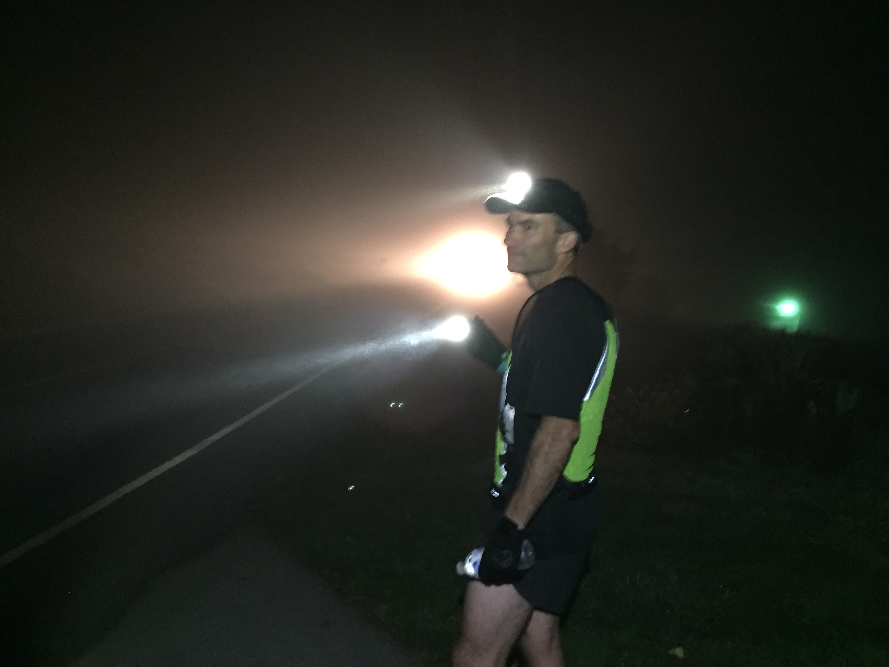

After weeks (months?) of run training for BRR, doubling up most mornings (Insomnia + Vesper = CRAZY), several #themaynards, it was nice this morning for a PAX of 9 or so to head off for a coolish Vesper.

Insomnia - PBX, Chanticleer, Largemouth, Hermes, Shut-In, Callahan

Vesper 4s - Shut-In(run doubledown), Ollie, Term Paper, Goose, PBX(run doubledown)

Vesper 5s - Hasselhoff (run doubledown), Hotspot (run doubledown), Old Maid, Sooner

The Thang:

As the Insomniacs had just finished a 4+ mile Castalia loop in one direction, Shut-In called for a similar route in reverse.  YHC was unsure of his legs, and what his heart felt. After a few hundred yards, the calves and quads seemed willing to go a little further. Hotspot was looking for a pal to go 5, Hasselhoff was fighting off a newfound cold, and Sooner was along for the therapy run (note Sooner is MUCH faster than this pace, but he hung back with us as he was unsure of how to get back home).

YHC, Hotspot, Sooner, and Hasselhoff made our way up High House to Maynard, then hung a left.  Conversational pace, though Hotspot was convinced we were running around 8 min/mile (alas, no).  Roller coaster down and up Maynard to James Jackson, then down the slide.  All the while solving the world's problems.  Or at least Hotspot's :)

Circled back briefly and picked up Hasselhoff after we got up to Cary Parkway, then set off to conquer the Parkway climb.  A good effort up the hill, all the while we chatted away.  Hasselhoff had given us the green light to take it on home without him, he knew the way and the cold had a grip on him.

One last turn back left onto High House, and Hotspot turned on the jets up the hill.  We rounded out the climb and entered the park at about 4.8 miles and 6:28 on the clock. Hotspot and Hasselhoff got in their 8 miles, YHC ticked over 5.

Quick recovery while waiting on the #SNS crew to finish up the bootcamp (plank, pike stretch, right arm high, left arm high, while Tango Papa protested), then circle up for COT (led by Nantan Ma Bell).

NMS:

Felt good to just go out and get some fresh air in the lungs, and not have the pressure of a slapband exchange (or a missed one more like it) or filling in "the spreadsheet", or consulting the notebook of who's turn it was to run, drive, or navigate, or watching out for those #F3Lexington guys who were breathing down our neck the WHOLE way in BRR.  Good to see everyone this morning.

Hey, did y'all hear how Weed and Feed found us?  At Blue Ridge Relay, that's how!  Man, that speaks volumes about F3, that him seeing the fun we were having at BRR would make him want to come join us here in Carpex.  Howboutdat?

Had tweeted a #doubledown last night, and it turns out that waking up at 5:01 precludes that happening from the running front, so Refinery was in order.  A great casual discussion of baptism, Church visits, and general great 2nd and 3rd F time at Bruegger's.  Y'all come.

OM out

