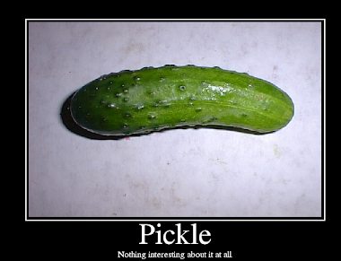

I leave the house with a little concern that lightning may eliminate this workout, but once again the weather cooperates and provides a nice workout window.  Saban even does an EC run to try to draw any leftover lightning bolts to keep the rest of us safe.  It is beautifully warm.   

I have never been on Q at DZ.  When Bagels and I were pacing Banjo on the MST 100 last weekend he told us that once upon a time DZ was the only active AO in Cary.  Of course Banjo had run 70 miles at this point and could have just been hallucinating.  But I'm going with it and am honored to be here.      

7 more join Saban for the start.  A solid crew with some mumble chatter all-stars mixed in.

No FNGs.  Pledge.  Mosey around the Pickle and circle up:

- 5 GM IC
- 25 SSH IC
- 15 IW IC
- 15 Sir Fazio IC
- 15 Fazio Sir IC

I suggest that we stay put and try something new.  No one objects, although there is grumbling about what happened the last time someone "tried something new" at DZ.

- Experiment 1 - Line up for an Indian Run, but everyone performs Squats in place while the man in back Lunge Walks to the front.  Luckily Red Ryder had shown us proper form for both of these exercises just 24 hours ago.  This takes way longer than I had anticipated, but I like it anyway.  Afterwards we run the Pickle.
- Experiment 2 - Same drill, but with Merkins and Bear Crawls,  This one hurts a lot.  Run the Pickle.
- Experiment 3 - Not really experimental, but I'm on a roll.  Chilcutt Leap Frog.  Run the Pickle.

By this point Saban is barking about mileage minimums, so let's head over to the basketball courts and partner up for the following.   

- Double Court Interval Sprints / BTTW
- Double Court Interval Sprints with Backpedal / People's Chair
- Double Court Interval Sprints / LSF
- Double Court Interval Sprints with Backpedal / CDD

Yet another lap around the Pickle brings us to the stairs by the volleyball courts for calf raises (Both 20x IC, Right 15x IC, Left 15x IC).

One final lap around the Pickle and back to the flag for LSF, WW2s and a Chilcutt to close us out.  If there is a Local Legend designation in Strava for this Pickle we should definitely own it. TCP Sawgrass Sunday.  Prayers for upcoming surgeries.  YHC took us out.
