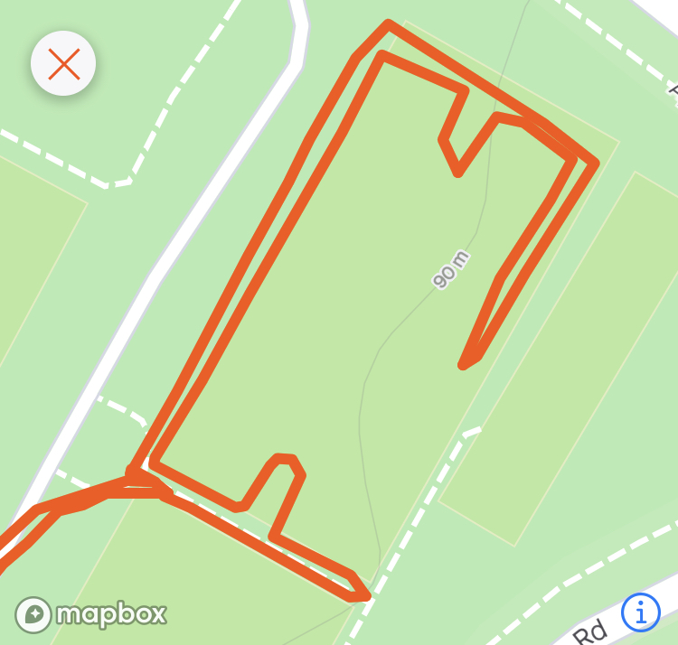

It feels as though it's been a little while since YHC has Qed a workout. There was a little stumbling with order of events, but all in all, I think the PAX received a decent beat down. With what was supposed to be the Tobacco Road 1/2 and full marathons scheduled for this Sunday which is now the new and improved OTB TRM, the original plan was adhered to with no lower body exercises while trying to get the training plan's 2 miles. Mission accomplished. Here's what went down.

**Warm-up:** No FNGs. Pledge recited (almost IC) and off we go to the far soccer field. What happened there is loosely depicted above. The goal was to make a Strava F3 logo. I suppose it was somewhat successful. Then we headed back to the flag for:  
GM x 5 IC  
Hillbillies x 10 IC  
Sir Fazio Arm Circles fwd/rev x 10 IC each way  
Seal claps x 10 IC  
Plank Jacks x 10 IC  
Calf Stretch L/R x 10 silent count

**The Thang:** Mosey to the other side of the park to the pull up bars. Partner up for a Murph inspired Dora.  
100 Pull-ups  
200 Merkins  
300 LBCs  
Other partner runs the pond pickle.

**Stretching/Mary:** Mosey back to the flag for a little pre-run stretching  
Low slow flutter while we wait for the six.  
Stretches were as follows: glut stretch L/R, Runner's stretch L/R, Pigeon stretch L/R, Butterfly stretch, Quad stretch L/R. There may have been more, it started to fall apart at this point.

**Announcements:** MULE tomorrow. OTB TRM Sunday- May still need some volunteers.

**Prayers:** Two factor's friend that's awaiting a lung transplant. Prayers to all of us as we face this unknown virus. Prayers to those whose livelihoods are in jeopardy with the illness. Look out for your family and yourself first, but don't forget your fellow man. MIAGD.
