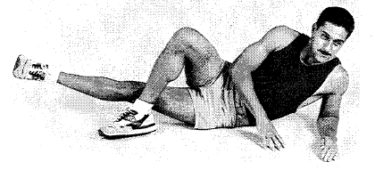
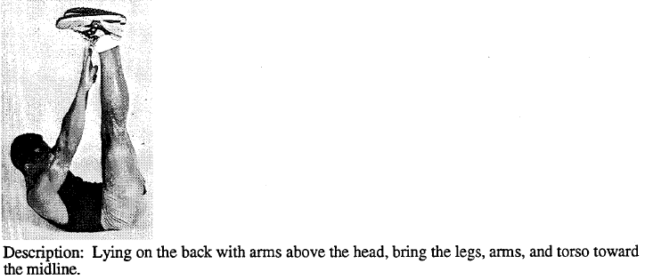

Mr. Brady over in Churham sent me a document produced in 1994 by the Naval Health Research Center entitled "Expert Panel Review of Naval Special Warfare Calisthenics."

[NSW exercise](https://f3carpex.files.wordpress.com/2017/08/nsw-exercise.pdf "NSW exercise")

In it are several exercises we do - though we call them something different - that they recommended to stop doing. Others they recommended modifying, and then there were some they added. In addition, there are several tips about how to do and how not to do some of these exercises. I thought we could learn from this, as you get more out of an exercise by doing them in proper form than the quantity you do. Here are some of the highlights \[with commentary\]

Eliminate

- **Windmills** - I always thought the windmill was an underrated exercise. Apparently it is _over_rated
- **Cherry Pickers** (what we call Cotton Pickers) - introduced to us by I think Shutty who got them from Charlotte. Nothing good ever comes out of Charlotte. I keed! I keed!
- **Stretches** (straight down, one leg crossed over the other) - hell, those were staples of my football stretches
- **Thigh Stretch (2 person**) - yeah we better not be doing those anyway. This is akin to the 2-man luge IMO
- **Back Stretch** - I couldn't get in that position (p. 26) if I wanted to
- **Hand to Toe Sit-ups** (what we call WWII Sit-ups) - I was a little surprised by this. But the concern is that it puts undue strain on the lower back and could cause injury. They recommend  feet flat on the ground (Big Boy Sit-ups) or, ideally, what we call LBCs

Add

- **Burt Reynolds** - I shit kid you not. There is an exercise named the Burt Reynolds. Is this the @burtcarpex signature move?

- **Donkey Kicks** - same as we call them
- **Finger-Tip Push-Ups** (what we call Fingertip Merkins) - yes! Expect to see more of these from YHC...
- **Push-Ups With a Plus** - We don't have an equivalent, but me likey!
- **Stretches** (Various) - See the document. We should do more stretching. But the right kind of stretching.
- **Superman** - same as we call them
- **Incline Pull-Ups** (what we call Australian Pull-Ups) - we need more rails
- **One-Legged Squat** - same as we call them
- Dying Cockroaches - Actually they recommended modifying the V-Ups to what looks exactly like our DCs

Recommendation: read through the document linked above and modify as needed. We're not professionals but these Navy guys are.
