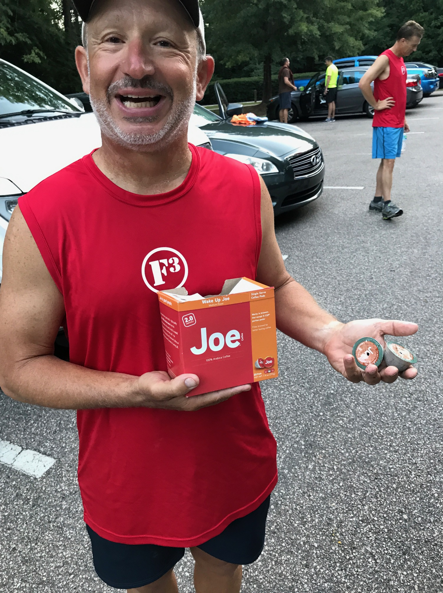

YHC was super pumped up with Q-Drenaline for his VQ. So pumped up that he initially got into the car this AM without his running shoes.  So pumped up that he drew up a 2-sided weinke in 4-point font that was entirely unreadable in the early gloom.  So pumped up that he was nearly made late for his own VQ while waiting for "Gonna Fly Now" from the Rocky Soundtrack to download, so that YHC could get into the proper mental/emotional state on the drive to FWD.  So pumped up to be greeted by 29 PAX upon arrival, including Burt handing out complementary used coffee pods and Hello Kitty donning an intimidating high school varsity jacket.  YHC could tell the PAX was pumped up too.  The VQ lessons learned by YHC today were like the warm-up merkins - numerous and fast.

**The Warm-Up** Disclaimer delivered to 2 FNGs and off we go.  Mosey 'round the gherkin (thanks Ollie for small-pickle clarification) including karaoke and circle up.  Count-o-rama and then

- 10x Good Morning IC ("IC" used loosely, but YHC feels he sort of got the cadence thing sorted out by the end of Warm-Up...sort of)
- 10x Standard Merkin IC
- 10x SSH IC
- 10x Wide-grip Merkin IC
- 10x Cotton Picker IC
- 10x Diamond-grip Merkin IC

Mumble chatter reminding YHC to "save some merkins for the rest of the week." We are clearly off on the right foot today.

Mosey ("mosey" used loosely, YHC was pretty fired up the whole time about Qing and the PAX moved quickly throughout) to the powerline easement, squat hold for the 6, and mosey on up to the Big Bridge for...

**The Thang** Mosey to middle of Big Bridge, squat hold for the 6 while enjoying the view and the exhaust fumes.  Balls to the wall, then lunge walk to the far side and partner up for...

Partner Dora 1-2-3: 100 merkins, 200 squats, 300 American Hammers.  P1: bear crawl to the halfway point on Big Bridge, jog to far side, 5 burpees, jog back.  P2: exercise.  Flapjack.

Plank hold for the 6, then back to Big Bridge center for People's Chair, then mosey back to the gherkin for...

Rock Work: grab ego rock and circle up. 10 rock curl, 10 overhead press, 10 tricep extension, 10 "rock-ups" (turns out these are called big boy situps...come on, lexicon!).

Lap the gherkin and adios rock.  Mosey to the parking lot, AYG to the flag in 2 waves, and mosey to the world's smallest basketball court for...

**Mary**

- 20x LBC IC
- 15x box cutter IC
- 15x Homer to Marge IC (with feeling)
- 20x WWII
- 15x Hello Dolly, feat. Callahan

**COT** Name-o-rama: 30 PAX including 2 FNGs - welcome Sosa and Build-a-Bear!

Announcements: Backpack Buddies being collected at all AOs, final collection is this Thursday at BO; 3rd F every Wednesday after SNS/Vesper; it's still VQ week, thanks for the support; Pet Sounds lake house trip in October, all are welcome and please RSVP; Pet Sounds leading F3 expansion to Chicago IL, if you have connections in Chicago and/or are interested in weekend travel there to help F3 realize a major new expansion please contact Pet Sounds; F3 Dads on 8/26/17.

Prayers: congrats Aspartame and family on new baby; prayers for Milli Vanilli's friend's mother Virginia in hospice, and Callahan's boy Luke who is in Boston for medical scans and dealing with illness.

YHC took us out.

**NMS** YHC is extremely appreciative, blessed, and fortunate for having been able to experience F3 these past 3 months.  However, YHC most certainly did not fully appreciate the amount of planning and foresight involved in Qing a workout.  Frankly, YHC is lucky not to have collided with any trees today given how often he was checking his watch and fumbling for his weinke in an effort to keep things on track.  For those PAX who have Q'd workouts that I have attended to date, please know I am that much more indebted to you for your efforts.  For those who are about to Q, we salute you.

Special thanks to Term Paper who kindly observed that YHC was a little disheveled when YHC arrived and exited his car in a pumped-up flurry holding his water bottle, phone, keys, weinke, extra socks, first aid kit, EPIRB, compass, sundial, and all of his other worldly possessions.  YHC discretely returned his armful of possessions to his car so that YHC can look lean respectable for the rest of the PAX.

Special thanks to Chanticleer and Chinese Downhill for pointing out the folly of calling 300 4-count American Hammers during Partner Dora, and advising that such a call would be "respectfully declined."

An honor to lead you men today.  YHC is already looking forward to the next one.  YHC is definitely getting his varsity jacket dry cleaned in advance.

