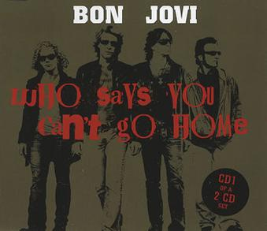

Or as Frisco, said, YHC left Carpex for a younger, hotter region Q. When I saw the Q swap sheet go up, I jumped on A-Team, as it was a place I had not Q's when I was working out with Carpex and a favorite. I knew it was going to be a big crowd, and it was. I was excited to get going, so YHC forgot to check for FNG's.

Mosey'd to the lot on the far right for Warm-up, and checked for FNG's  
**FNGs:** None  
**Warm Up:** 15 SSH, 15 Imperial Walkers, 15 Hillbillys, 10 Sir Fazio forward and backward, 10 Good Mornings ( the south wake way)  
**The Workout:** Mosey’d to the far picnic shelter in the back of the park.  
       **Thang 1:** Dora 1,2,3, 100 LBC's, 200 Step-ups, 300 Dips

       **Thang 2:** 7's with a twist as someone said Star Jumps and Moneky Jumpers, but on the middle do 5 merkins each time.

Mosey'd down to the Hill, to 10 Burpies oyo so we did not get so far ahead of everyone and mosey to the first lot on the right for Mary

**Mary**:  LBC's Pickel Pounders, Homer to Marge, Freddy Mercuires, Have a Nice Day  
**Announcements**:  Q Swap week continues, Tomorrow Disturbing the Peace and Rush Hour  
**Prayer**: Disco's Family, My Wife's Uncle Jim and his family who has passed away from cancer, our Troops who are deployed and may be deploying. Open Out took us out.

**COT:** 29

**TClaps**:  7 South Wake him who came to A-team as well as most of YHC's shield lock team. #3rdWatch

**NMS**: As always and honor to lead. It was great to be back at A-Team, someplace I had not posted since YHC moved to south wake. This was the largest group I had every Q'd but it was fun. Thanks to everyone who came out, it was great to reconnect with some familiar faces, as well as meet a few new ones.
