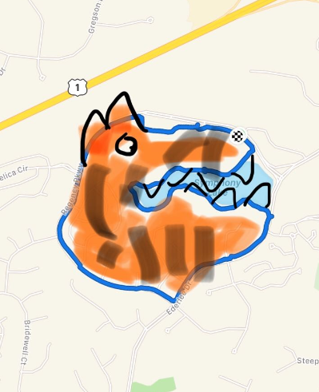

Feeling like we were on the hunt, 6 showed up for a high temp bootcamp, must be spring break...

Savvy veterans on hand, no need of a long drawn out disclaimer, we're off.

Over to the first lot on the Regency loop for: SSH, Sir Fazio, Seals, Sir Fazios and over to the curb for QF and merkins

The Thang:

- Hit the loop, stop along the way for various exercises, true pearls on the string. All counts at 15 for Tiger's 15th major championship. It was a full body workout as stops included CDDs, various Merkins and Squats (among other thangs), all with a bent waist arm exercise to boot (e.g. flies, arm raises, etc.)
- At the bottom of the loop, back in through the trail to ensure we hit the 3-mile minimum and a bear crawl at the bridge.
- Back into the lot for a round of Mary with a trip around the circle, all pax calling an exercise.

COT: 6 studs, YHC took us out and the pax held hands (out of their comfort zone).

NMS:

- Tclaps to Peeping Tom for sharing a personal story with us during PUT6, take a listen and NO OYO!! [https://soundcloud.com/f3pickupthesix/pick-up-the-six-peeping-tom-ep-52](https://soundcloud.com/f3pickupthesix/pick-up-the-six-peeping-tom-ep-52)
- Finally... did we set out to draw strava art? No. Did it work out wel(ish)l. You be the judge...

