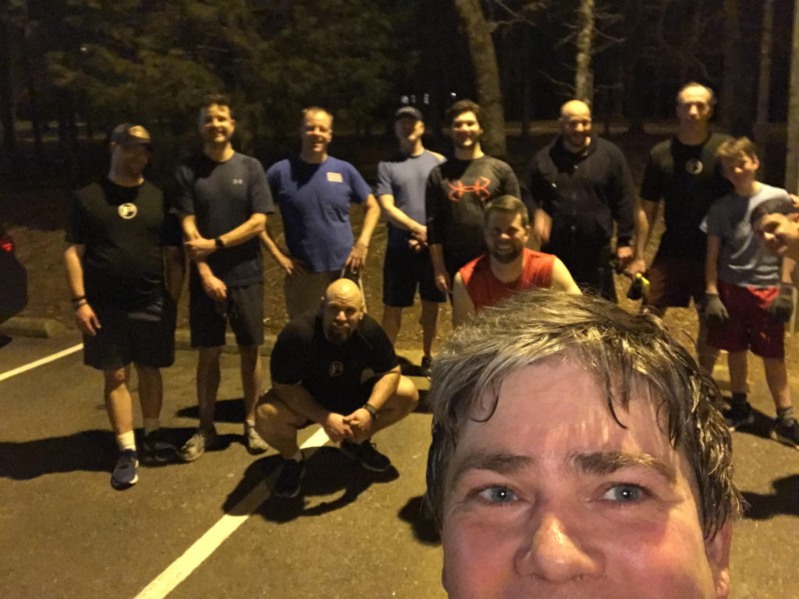

Greetings, Carpex! YHC just completed my 2021 Q Challenge in Raleigh (Q 21 different AOs) and I am spreading my wings. I've posted in Carpex a few times in the past (Danger Zone, Carpex Dads, Werewolf, and most recently Rush Hour). You might've noticed a few of us Raleigh guys dropping in to get points for a challenge we have going on this month. It was one of our Raleigh (ahem, Garner) brothers, Bouchér, who recently posted Rush Hour and opened my eyes to the evening workouts in Carpex. In my quest for points (but more importantly my personal Q quest) I noticed the Ragnarok Q sheet was open this week and signed right up. Cobains for not posting first. I have been poring over backblasts and Google maps hoping to not disappoint.

**Warm Up:**  
Give the mission statement, check for FNGs, give the disclaimer, and warm up:  
Side Straddle Hops x20 In Cadence (IC)  
Oops... Pledge of Allegiance!  
Good Evenings x10 IC  
Imperial Walkers x20 IC  
Sir Fazio Arm Circles x10 IC Forward x10 IC Reverse  
Monkey Humpers x10 IC  
Standard Merkins x10 On My Down (OMD)  
Mountain Climbers x10 IC  
Downward Dog with calf isolation stretches  
World’s Greatest Stretch  

**Main Event**  
**1)** Partner up for **Dora 1-2-3** around Chadstone Loop, as Strava calls it. Merkins x100, Little Baby Crunches x200, Squats x300  
**2)** Mosey to shelter for a **10-20-10 pyramid** of the Yukon Cornelius standard: Left-Right Step Ups, Irkins, Dips, Elevated Crunches, and Derkins. Cobains to Spit Valve and Boitano as Spit Valve told me it was the exact same thing Yukon had them do this morning at Tequila Sunrise. The perils of the triple down!  
**3)** A little bit of time, so Sevens... no... **Fives** (5s) on the newly paved side of Chadstone Loop. Squats and Star Jumps.

<figure>

<figcaption>

[https://www.strava.com/activities/4932050110](https://www.strava.com/activities/4932050110)

</figcaption>

</figure>

**Mary:**  
Dying Cockroach x20 IC  
Dolly x20 IC  
Homer to Marge x20 IC  
Freddie Mercury x20 IC  
Captain Thor - we made it to 6/24 before time ran out

**COT:**  
12 PAX  
Oakwood Cemetery is hosting a virtual 5K to raise money to make up for tour money that hasn’t been coming in during COVID. It runs through the end of the month, but Frey Daddy is organizing a group run during Black Ops on March 14 at 2PM.  
There is a blood shortage and Texas Ranger asks that we consider donating blood. There is a blood drive at Cornerstone Fellowship Church this Sunday.  
Prayers for Pet Sounds; prayers for those needing blood; prayers unspoken.  
YHC took us out

**Naked Moleskin:**  
T-claps to **Boitano** and **Spit Valve** for the first Thursday **TRIPLE DOWN** (Tequila Sunrise, Dark Knight, and Ragnarok). Very impressive. These two are fighting hard for Snowbird's March Madness Challenge in Raleigh. T-claps to **Snowbird** for posting as well. It was great to bring a few "over the wall" with me.  
One thing I quickly noticed once I started paying attention to the Carpex workout schedule is the opportunity for a **Superhero** **TRIPLE DOWN** on Thursdays: Green Flash (Raleigh 0530), Dark Knight (Knightdale 1745), and Ragnarok (Carpex 2000). To the stickler nerds who say The Flash isn't green, I say: 1) I'm sure there's a multiverse somewhere where he is green and 2) I found an article on the web that said the Flash would appear green as he approached the speed of light. Q. E. mfn' D. Anyways, it could be a fun CSAUP on a free Thursday.  
**TANG** and **Texas Ranger** worked hard to knock me off my rhythm early on with the mumble chatter. Talk of possibly free swag was hard to ignore.  
**Mojo** can move when motivated. On the first Dora lap, I warned him Snowbird was catching up and Mojo took off!  
**Drummer Boy** was working hard on those Doras!  
Ragnarok is a great AO and it nice to have an evening AO option, especially when trying to EH guys whose balk at crack-of-dawn workouts. The swag is nice, too. I was happy to hear I unlocked the swag achievement with my Q and scooped up a nice smedium.  
This was my twenty-second #F3Q21 #2021Challenge Q. Next stop is Quickhatch on 3/13. 
\-Pigpen

<figure>

<figcaption>

Selfie Skills Need a Little Work

</figcaption>

</figure>

**QIC:** Pigpen  
**PAX:** Boitano, Chewie, Doggy Paddle, Drummer Boy, Horatio, Mojo, Ollie, Pigpen, Snowbird, Spit Valve, TANG, Texas Ranger  
**Workout Date:** 03/11/21
