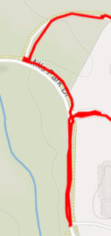
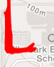
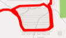

Hurricane's a-comin'... calves are burning... maybe we do want a little bit of rain!

No FNGs, Follow Me!

 

Head out the road on which we came in, stopping to give time for Scarecrow to catch up for Good Mornings. Continue to the intersection for 10 Penalty Burpees OYO, followed by Imperial Walkers. Turn left toward the schools, stopping at the next intersection (pickle) for Windmills, Calf Stretches, and Standard Merkins.

Continue to the end of the road for our first thang:

10 Wide Grip Merkins

Right over Left Calf Stretch

10 Standard Merkins

Left over Right Calf Stretch

10 Diamond Merkins

 

Back to the pickle for a Bear Crawl out and Lunge Walk back. First step in our Rain Dance complete.

Mosey out to the Elementary School for a little Peoples' Chair while we wait for the 6. Next up - ONE CORNER!

Starting at the wall, do 10 Australian Mtn Climbers, run to the corner, do 5 Squats, run to the cones, do 10 Star Jumps, then work back and repeat, adding 5 Squats at the corner each time. Work up to 25 Squats, then hang at the Star Jumps spot. Second step complete.

A bit of time remains, so let's work in a bit of Catch Me If You Can, where the exercising PAX does 5 Merkins.

 

Now that the rain dance is complete, mosey back TOWARD the flag, stopping once for LBCs (unless you're not an elite athlete who is at the end of their workout), then continue to the flag for Mary consisting of

American Hammers // Box Cutters // WW2 Situps // more LBCs // Hello Dollies // Homer to Marge

 

HAVE A NICE DAY // THAT'S IT

 

COR/NOR - 4 RESPECTS, 12 mehs, 2 HATES

 

Announcements:

Check out the Disaster Recovery Channel on Slack, especially if you can offer assistance

Geek Squad is trying to get to 12 people for a 9/11 Shirt order (YHC is IN)

F3 Family Picnic on 9/16 postponed

Bring kids bandaids to any AO, deliver to site Qs

 

Prayer Requests:

Those in the path of Flo

Everything on the 3rd F channels

 

NMS

Only my third time out to Flying Circus. It's really a beautiful AO but I wish I didn't live SO. DANG. FAR from it. 25 minutes with no traffic this morning!

Strava artwork workout #2 for me wasn't quite as evident as I'd hoped, thus the spell-it-out nature of this Backblast.

Stay safe out there, gents. Glad to spend part of this calm before the storm with you this AM. Let's not miss God's presence in these quiet moments.
