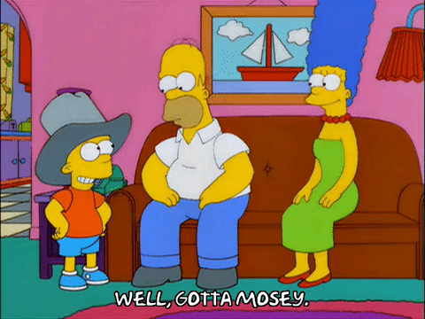

YHC's birthday Q week rolls on. I was excited to get after it this morning feeling strong after a long run last weekend and two solid workouts to start the week. Read all about them [here](https://f3carpex.com/2020/08/17/i-scream-you-scream-we-all-scream-for-a-team/) and [here.](https://f3carpex.com/2020/08/18/bucket-handle-meniscus-tear-we-report-you-decide/) Upon arriving at Point Break, parking was limited. There was quite the turnout for 'Das Boot' or whatever the name is of the new long run option on a Wednesday that isn't The Maynard. Das Boot is actually a misnomer because I think it actual means 'The Boat' in German and the running route looks more like an actual boot but 'Das Schuh' doesn't have the same ring to it. It actually sounds more like a sneeze. What the hell am I doing here? On to the beatdown. Focus, Roseborough.

Preamble: 10 pax gathered round and listened to the disclaimer. First exercise: Pledge of Allegiance. Mosey to the upper lot on the other side of Shake Shack.

Warm Up: Good Mornings, Merkins, SSHs, Sir Fazios, Fazio Sirs, and Sprinklers. Mumblechatter abound on the new sandwich shop, Capriottis and another new place, Chicken Salad Chick. Not sure about opening an entire joint on chicken salad but I'll give it a go when it opens. Although, I make this [recipe](https://www.southernliving.com/recipes/greenbrier-chicken-salad) and IMO, you'll never need another recipe once you make this one. Trust me. Pic below but I usually go with it on a croissant or in a pita pocket. I've eaten at Capriotti's locations before, there was one up the street from my office in Rosslyn, VA. Very good sandwiches but they were $20. Hopefully Cary italian sammich prices are better than Northern Virginia's. Damn it, again. Focus, Roseborough.

Thang 1: Mosey back down to the Waverly Pavilion with all the water features. Ups and Downs. Start with 10 monkey humpers, run up the stairs and do 10 merkins, run down to the bridge over troubled water, 10 squats, run down to the playground and 10 Carolina Dry Docks, and run back to the start. Repeato the circuit until my watch hits 1 mile. I think we did 3 total circuits. Speaking of three, one of our very own HIMs has had not one, not two, but THREE bucket handle meniscus tears. @Hamm says @JoeSmith just needs to do the surgery and come back stronger. Hamm was riding a bike and playing soccer again three weeks after his last surgery. I maintain we can still #DIY this thing this weekend in the green house. Demo video refresher [here](https://youtu.be/gkmKUBuo6hU). If you've read this far, keep going. It likely won't be worth it. Focus, Roseborough.

Thang 2: Mosey to the back of the Duke Health complex where the secret formula for Coach K's hair dye is developed and maintained. Partner up for Catch Me If You Can sprint intervals. Partner 1 drops for 10 merkins while Partner 2 takes off down 'The Backstretch' under the buildings with All You Got. Mosey on the outside letting your partner catch you. 10 merkins for partner 2 and then take off. These sprints were tougher than anticipated. Repeato 3 times.

Thang 3: Lunge walk up the hill beside the building, mosey down the front, bear crawl down the other hill and mosey down The Backstretch again. Quick time check and watch malfunction, let's mosey back to the flag.

Mary: Back to the flag for LBCs, WWIIs, Homer to Marges, and Diver Bombers. Forgot how great a stretch the diver bombers are. By the time we got to five, there was a minute left and YHC was cooked. Hope the boys were too. As we finished many a Das Boot participant rolled in. These HIMs are fast, glistening, and ready to tackle the day. YHC took us out with a little mumblin' and stumblin' towards the Sky Q.

Carpex LOVES Wednesdays. Our officially unofficial bean counter @Riptide had this morning's total at 109 across all AOs. Well done, men. Absolutely outstanding numbers of pax getting stronger and better together. Humbled and proud to be a small part of such an amazing group of HIMs.

Make it a great day, men.
