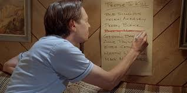

No need to get into details, but the last time YHC posted at DTP he almost left in an ambulance.  Some guy probably once said “you can break my body, but you can’t break my spirit.”  That guy was also probably concussed.  But whatever.  Let’s call it a mantra and get this revenge tour kicked off.

No FNGs so we go to the Pledge.

Warmup:

Mosey around to the other side of the church and circle up:

- 25 SSH IC
- 10 Mountain Climber Merkins IC
- Calf Stretch
- 10 GM, but only because Crimson is in attendance

We are definitely loose enough, so let's mosey.

Thang One:

7s with burpees on the bottom and WWMs on top.

The magic of this process was the run.  It encompassed approximately 2 miles with half of that being a nasty vertical.  Props to the men of DTP because everyone absolutely crushed it.

Thang Two:

Mosey back to the parking lot and circle up for PAX choice exercises.  No need for a rep target because we had a timer, which was a lucky PAX who got to sprint across the parking lot, perform some exercises with a coupon and then sprint back.     

During this process we learned that when in the circle formation, the tendency is to call an ab exercise regardless of how many consecutive ab exercises have previously been called.  Chicken Little and Crimson were kind enough to provide bookend merkin work.

COR and NOR

Announcements:

- Thanksgiving Convergence
- Christmas Party

Prayers and Praises

YHC took us out.

NMS:

Great work by everyone present.  Round 1 of the Revenge Tour was likely a draw, but YHC will be back for more.
