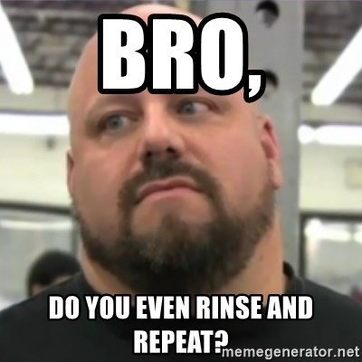

Some folks may be aware that YHC does not typically post on Tuesdays and Thursdays as those are the M's mornings to go to the gym. Well, with the 1.0s in town, the unique opportunity has arisen for YHC to not only post, but jump on that Q sheet. So I decided to take my talents to downtown Cary, if for nothing else, free deodorant and beer. I just Qed on Friday so figured why not just run that bad boy back since only Wahoo was at that Q anyway and when I apologized that it was redundant, he didn't seem to notice and stated, "They all run together at this point." So here's what we did. Again.

**Warmup**: No FNGs, so we recite the pledge and off we go. YHC usually likes to state the mission of F3 but sort of forgot so had to handle that while running. We head on over to the "circle of lights" on Chatham street and circle up for:  
SSH x 15 IC  
Good Mornings x 5 IC  
Sir Fazio Arm Circles x 10 IC  
Seal Claps x 10 IC  
Imperial Walkers x 10 IC  
Plank Jacks x 10 IC  
Calf Stretch L/R x 10 silent count each side

**Thang 1:** Head over to the train station and partner up with both partners grab a rock. Dora time. Partner one works on 100 triceps extensions, 200 rock rows and 300 curls while partner 2 runs around the station. YHC didn't realize how busy of a place the train station was around 0600. What out for traffic! Flip flop until you've completed all reps (or everyone claims they're finished.)

**Thang 2:** Mosey to the fountain and everyone grab a spot for 2 rounds of Derkins x 10, Dips, x 10, Irkins x 10 and L/R step ups x 20 IC. Head back to the parking lot adjacent to the flag.

**Thang 3:** Everyone line up on the curb. Bear crawl 2 parking spaces, then perform 1 merkin. Continue bear crawling increasing the number of merkins by 1 every 2 spaces until you get to the other side of the parking lot. Bring it back to the beginning with lunge walks and Steve Earle's on the way back.

**Mary:** Just a few minutes left so we hammered out some LBCs x 20 IC and E2K L/R x 10 IC. Have a nice day.

**COT:** Freed to Bleed May 1st at Cary YMCA. Pet Sounds for deets. TCP Sawgrass this Sunday. No spoken prayers today. YHC took us out.

Thanks for letting YHC lead on a Thursday. And especially to Burt for the beer and deodorant. MIAGD!
