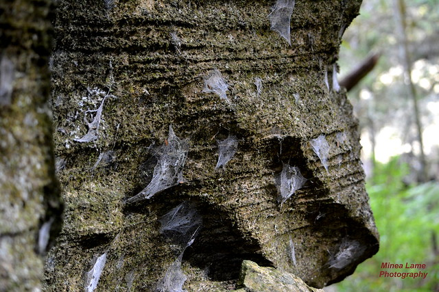

Arrived at 5:00ish to with my new headlamp to scout out some areas we hadn't visited in awhile. Amazed that there were already at least 6 cars parked on Laura Duncan with HIMs lunge walking the hill, the Army Physical Fitness testing and EC running. Way to start this week off strong!

**Warm Up** - Good Mornings (SW style), SSH, Runners Stretch Calf Stretch, Sir Fazio, Overhead, Seal

**Thang 1** - 11s on the hill - Mountain Climbers up top, Jump Squats at the bottom. Needed to make up some lost time on the hills  

**Thang 2** - Rock Webbs - Incemented up to 10 of these and they SUCK! Told the PAX to pick a travelling rock, feel sorry for those who travel heavy.

Indian Run back to the parking lot for some Mary.

**Announcements** -

- **9/2** - Carying Place Labor Day 10K + SPEED FOR NEED
- **10/7**  "The Odyssey" CSAUP
- **11/15-17**  Grow Ruck Quicksand

**Prayers/Praises**

- Skipper - Job Search
- Parkers FIL
