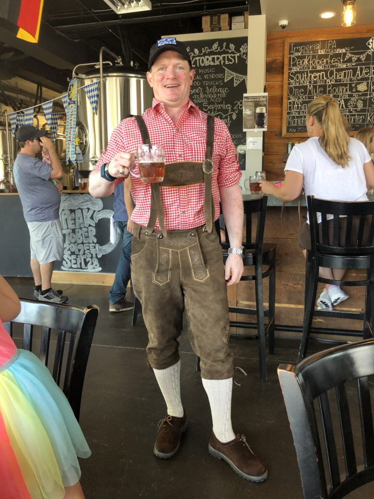
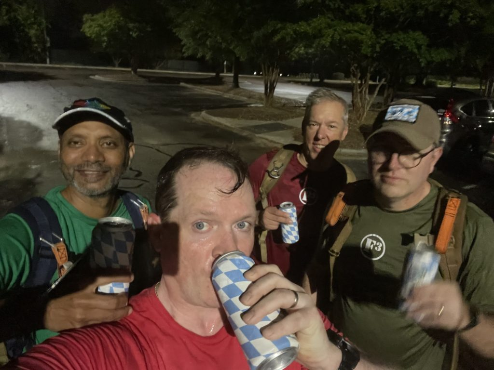

So Rucktoberfest started as an idea I had back in 2019. And while I have never been to the actual Oktoberfest in Munich, I am assuredly of German heritage, speak German, have a second major in German, and while I was in college, I lived for a year in - you guessed it - Austria (_side note - I actually spoke really proper "high" German before I lived in Austria for a year, but it completely ruined my near perfect accent, and apparently I now speak German with a Swedish accent)_

The whole idea was to go to various Oktoberfest celebrations in and around the Raleigh - Cary - Durham area, ruck a few miles, enjoy a beer or two, and create a really dope patch to give to participants. Turns out people have a lot of 2.0 and family commitments on early fall Saturdays, so I had a ton of leftover patches. So I decided this year, I would do a Rucktoberfest celebration at our dedicated ruck AO, Rolling Stone.

I arrived to the Green Hope Elementary School parking lot at 5:24, which is about 7 minutes earlier than my average arrival time for the 5:30 start time. Had the Oktoberfest Music playlist from Spotify blaring on the MKZ's stereo, and a bunch of beer and extra rucks in the trunk. Having checked the weather the night before (67 and humid with a chance of rain) I was clad in normal ruck gear, instead of my authentic Lederhosen kit. Bartman was already there, as was Chop Block. Trike came screaming in on two wheels at 5:29, and sauntered over wryly with more than a tinge of booze coming out of his pores. We did the pledge with the Gran Torino guys, and took off for our Rucktoberfest workout.

<figure>

<figcaption>

Warning - rucking in Lederhosen can lead to extreme swamp ass

</figcaption>

</figure>

Warm up - ruck about a mile around the school, into the neighborhood, back around the fields, and get to the picnic bench shelter, with the Oktoberfest Music playlist on my trusty JBL Flip 4. After some Good Mornings, it was time to learn one of the all time best German drinking songs, "Ein Prosit," which is ridiculously easy to remember (it only has four words) and equally fun to sing.

_Ein Prosit, ein Prosit, der Gemuetlichkeit_

_Ein Prosit, ein Prosit, der Gemuetlichkeit_

Rough translation: A toast, a toast, to feelings of well-being, comfort, and friendliness

Further aspects of the warmup included learning steps to the Schuhplattler, or shoe slapping dance. I'm sure we looked ueber-goofy to any onlookers, but thankfully there were none. Then move on to a squat - triple air press combo to the drinking chant "Zicke Zacke Zicke Zacke Hoi Hoi Hoi" (down on the first Zicke Zacke, up on the second, followed by an air press on each Hoi). It was about this time (5:48) where we had the first request to stop early and go drink beer. Request denied, continue on to some exercises that would be beneficial at Oktoberfest, such as single arm ruck raises to prepare for stein-holding contests (these were harder than I had imagined), Ruck curls to prep the biceps for hours worth of 7 pound curls (a typical liter stein has over two pounds of beer and five pounds of glass), and farmer carries for carrying cases of beer and/or merchandise. After the farmer carries around the picnic shelter, we did Ruck Zicke Zacke squats, holding the ruck in our hands vs on our backs as done earlier. And what trip to Bavaria would be complete without a hike in the Alps, so to replicate this, we did 50 step ups on the picnic benches.

Time check, it's 6:09 so we head back to my car, drop our rucks, pop the trunk, and dive into New Anthem's Hundstage, their version of a Munich-style Festbier. I taught the PAX on the appropriate way to toast in German speaking countries, which is done on an individual-by-individual basis, looking the other person in the eye as you touch glasses (or in this case, cans), and then gave the PAX their dope patches. After the obligatory selfie, the Gran Torino guys made it back at the shovel flag. We made our way over and did some half hearted Mary with them, and GT's Q, Clementine, took us out.

<figure>

<figcaption>

Obligatory selfie

</figcaption>

</figure>

We had a lot of fun, laughed quite a bit, and learned when Trike is still semi-buzzed during a workout, that instead of counting reps, he just yells the F word. Thanks to these fellas for coming out for Rucktoberfest, it was an honor to lead!
